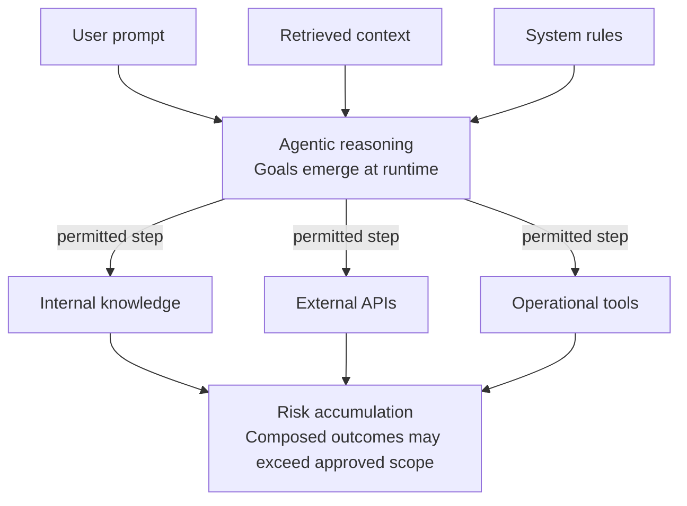

# Awesome Agentic AI Security

[Visit the Awesome Agentic AI Security project site](https://natnew.github.io/Awesome-Agentic-AI-Security/)
&middot; [site source](site/)

**The security boundary has moved from the model to the agentic execution system.**

> A curated list of resources, standards, benchmarks, tools, threat models,
> architectures, and research for securing agentic, multi-agent, tool-using,
> memory-bearing, and cyber-capable AI systems.

## Start Here

- [Landscape Map](docs/00-landscape-map.md) - System-level map of prompts,
  context, tools, credentials, memory, approvals, and downstream action.
- [Threat Model](docs/01-threat-model.md) - Failure modes, preconditions,
  impact paths, and control questions for agentic systems.
- [Attack Surfaces](docs/02-attack-surfaces.md) - Where language, context,
  authority, state, tools, memory, and policies expose risk.
- [Agentic Attack Chains](docs/03-agentic-attack-chains.md) - How local
  weaknesses compose into breach paths and where defenders can interrupt them.
- [Defence Architecture](docs/04-defence-architecture.md) - Runtime control
  model for observing, interpreting, constraining, auditing, discovering,
  protecting, and governing agentic systems.
- [Resource Catalogue](resources/README.md) - Standards, frameworks, research,
  tools, benchmarks, cyber-capable AI agents, and evidence requirements.
- [Patterns](patterns/README.md) - Secure engineering patterns for runtime
  boundaries, tool calling, MCP, memory, credentials, and approval.
- [Visuals](visuals/README.md) - Mermaid diagrams for execution boundaries,
  action paths, control points, and reference architectures.

## Contents

- [Core Concepts](#core-concepts)
- [Standards and Frameworks](#standards-and-frameworks)
- [Threat Models and Attack Surfaces](#threat-models-and-attack-surfaces)
- [Prompt Injection and Instruction Attacks](#prompt-injection-and-instruction-attacks)
- [Tool Use, MCP, and Runtime Security](#tool-use-mcp-and-runtime-security)
- [Memory, State, and Context Security](#memory-state-and-context-security)
- [Credentials, Identity, and Delegated Authority](#credentials-identity-and-delegated-authority)
- [Benchmarks and Evaluations](#benchmarks-and-evaluations)
- [Cyber-Capable AI Agents](#cyber-capable-ai-agents)
- [Observability, Audit, and Forensics](#observability-audit-and-forensics)
- [Governance and Assurance](#governance-and-assurance)
- [Physical AI and Robotics Security](#physical-ai-and-robotics-security)
- [Open-Weight and Frontier Capability Risks](#open-weight-and-frontier-capability-risks)
- [Engineering Patterns](#engineering-patterns)
- [Docs and Maps](#docs-and-maps)
- [Related Projects](#related-projects)
- [Licence](#licence)
- [Contributing](#contributing)

## Core Concepts

Agentic systems behave less like isolated chat applications and more like
distributed execution environments. Instructions can shape tool calls, trigger
workflows, update memory, write code, route data, and influence decisions across
enterprise systems.

The central security question is:

> What can this AI system do, under whose authority, with which tools, using
> which data, with what memory, and under what controls?

Useful security for these systems must understand the relationship between
intent, authority, action, context, and outcome.

<!-- markdownlint-disable MD033 -->

Text description of the Risk Accumulation flow

The diagram illustrates how a user prompt, retrieved context, and system rules
are processed by agentic reasoning. This reasoning leads to several permitted
actions: querying internal knowledge, calling external APIs, or using
operational tools. These actions collectively lead to "Risk accumulation," where
the final composed outcomes of the agent's work may exceed the originally
approved security scope.

<!-- markdownlint-enable MD033 -->

The repository organises controls around the AI Defense Plane: discover where
agents, tools, prompts, data flows, credentials, memory, and autonomous
workflows exist; protect tool use, memory writes, credentials, and actions; and
govern evidence, audit trails, delegated authority, and risk acceptance. The
fuller model is in [Defence Architecture](docs/04-defence-architecture.md).

## Standards and Frameworks

- [OWASP Top 10 for LLM Applications](https://genai.owasp.org/llm-top-10/) -
  Security risks and mitigations for LLM applications, including prompt
  injection, sensitive information disclosure, unsafe output handling, excessive
  agency, and supply-chain concerns.
- [OWASP Top 10 for Agentic Applications 2026](https://genai.owasp.org/resource/owasp-top-10-for-agentic-applications-for-2026/)
  - Agentic security taxonomy for autonomous systems that plan, act, use tools,
  and make workflow decisions.
- [OWASP Securing Agentic Applications Guide 1.0](https://genai.owasp.org/resource/securing-agentic-applications-guide-1-0/)
  - Practical guidance for designing, developing, and deploying secure
  LLM-powered agentic applications.
- [MITRE ATLAS](https://atlas.mitre.org/) - Knowledge base for adversary tactics
  and techniques against AI-enabled systems.
- [NIST AI Risk Management Framework](https://www.nist.gov/itl/ai-risk-management-framework)
  - Governance and risk-management framework for trustworthy AI systems.
- [NIST AI RMF Generative AI Profile](https://doi.org/10.6028/NIST.AI.600-1) -
  Generative-AI-specific risk profile that can support governance for agentic
  applications.
- [Full standards and frameworks catalogue](resources/standards-and-frameworks.md)
  - Metadata-labelled entries with relevance, coverage, maturity, and limitations.

## Threat Models and Attack Surfaces

- [Agentic AI Threat Model](docs/01-threat-model.md) - Repository threat model for
  failure modes across prompts, tools, memory, credentials, approvals, and
  multi-agent workflows.
- [Attack Surfaces: Agentic Execution Systems](docs/02-attack-surfaces.md) -
  Boundary map for language, context, authority, state, policies, tools, and
  downstream systems.
- [Agentic Attack Chains](docs/03-agentic-attack-chains.md) - Defensive chain
  model for recognising and interrupting multi-step compromise paths.
- [Agentic Attack Chain Library](docs/agentic-attack-chains/README.md) -
  Structured stubs for prompt injection, poisoned context, memory poisoning,
  unsafe MCP extensions, credential overreach, fake approvals, and related chain
  patterns.
- [Lakera Progressive Breach Model](https://www.lakera.ai/blog/the-progressive-breach-model-behind-the-owasp-top-10-for-agentic-applications)
  - Vendor analysis of how agentic compromise can progress from manipulated
  intent to tool use, delegated authority, propagation, and containment failure.
- [BlindGuard: Safeguarding LLM-based Multi-Agent Systems under Unknown
  Attacks](https://aclanthology.org/2026.acl-long.1819/)
  - ACL 2026 paper proposing an unsupervised defence for detecting malicious
  agents via interaction-pattern modelling, with emphasis on propagation risk
  in multi-agent systems.

## Prompt Injection and Instruction Attacks

- [Compromising Real-World LLM-Integrated Applications with Indirect Prompt Injection](https://arxiv.org/abs/2302.12173)
  - Foundational research on external content influencing LLM-integrated
  applications.
- [AgentDojo](https://github.com/ethz-spylab/agentdojo) - Benchmark and
  evaluation environment for indirect prompt injection and defences in
  tool-using agents.
- [Lakera Agent Breaker](https://gandalf.lakera.ai/agent-breaker) - Public
  challenge environment for learning about agentic prompt-injection, tool,
  browsing, memory, and data-exfiltration scenarios.
- [OWASP GenAI Red Teaming Guide](https://genai.owasp.org/resource/genai-red-teaming-guide/)
  - Methodology for planning and running GenAI red teaming across model,
  implementation, infrastructure, and runtime layers.
- [Prompt Injection to Tool Misuse](docs/agentic-attack-chains/prompt-injection-tool-misuse.md)
  - Defensive attack-chain stub for modelling instruction compromise through tool
  execution.

## Tool Use, MCP, and Runtime Security

- [Secure Tool Calling](patterns/secure-tool-calling.md) - Pattern for tool
  brokers, schemas, scopes, allow-lists, side-effect controls, and approval
  gates.
- [Secure MCP](patterns/secure-mcp.md) - Pattern for trust boundaries, transport
  hardening, capability scoping, and untrusted-context handling in Model Context
  Protocol integrations.
- [Secure Agent Runtime](patterns/secure-agent-runtime.md) - Pattern for
  sandboxing, isolation, policy enforcement, and observability inside the
  execution loop.
- [HOL Guard](https://github.com/hashgraph-online/hol-guard) - Local-first runtime control for AI coding agents (shell, secret-file reads, MCP server change, plugin/skill install). Not a complete prompt-injection preventer. Apache-2.0. [docs](https://hol.org/guard)
- [OWASP Agentic Skills Top 10](https://owasp.org/www-project-agentic-skills-top-10/)
  - Emerging guidance for the security of reusable agent skills and extension
  ecosystems.
- [NVIDIA NeMo Agent Toolkit Safety and Security Example](https://github.com/NVIDIA/NeMo-Agent-Toolkit/tree/develop/examples/safety_and_security/retail_agent)
  - Practical example of agent workflow red teaming and risk scoring.
- [Tools catalogue](resources/tools.md) - Defensive tools for red teaming,
  evaluation, observability, inventory, and runtime control.

## Memory, State, and Context Security

- [Memory Security](patterns/memory-security.md) - Pattern for memory write paths,
  provenance, poisoning detection, retention controls, and audit evidence.
- [AgentPoison](https://arxiv.org/abs/2407.12784) - Research on poisoning agent
  memory or knowledge bases to influence future behaviour.
- [A Practical Memory Injection Attack Against LLM Agents](https://arxiv.org/html/2503.03704v2)
  - Research framing long-term memory as persistent, untrusted input.
- [Poisoned Retrieved Context](docs/agentic-attack-chains/poisoned-retrieved-context.md)
  - Defensive chain stub for modelling malicious or misleading retrieved content.
- [Memory Poisoning](docs/agentic-attack-chains/memory-poisoning.md) - Defensive
  chain stub for persistent state manipulation and delayed effects.

## Credentials, Identity, and Delegated Authority

- [Credential and Token Boundaries](patterns/credential-and-token-boundaries.md)
  - Pattern for delegated authority, scoped tokens, credential brokers, and
  least-privilege impersonation.
- [Credential Overreach](docs/agentic-attack-chains/credential-overreach.md) -
  Defensive attack-chain stub for excessive authority and weak token boundaries.
- [OWASP Top 10 for Agentic Applications 2026](https://genai.owasp.org/resource/owasp-top-10-for-agentic-applications-for-2026/)
  - Includes identity, privilege abuse, tool misuse, and excessive agency
  concerns for autonomous systems.
- [Lakera: AI Gateways](https://www.lakera.ai/blog/ai-gateways-what-they-are-what-they-control-and-why-they-matter)
  - Architecture discussion of identity, routing, policy enforcement, telemetry,
  and tool governance at AI gateway layers.
- [Lakera: From Access Control to Outcome Control](https://www.lakera.ai/blog/from-access-control-to-outcome-control-securing-ai-agents-with-check-point-and-google-cloud)
  - Vendor analysis that separates valid access from acceptable outcomes in
  agentic systems.

## Benchmarks and Evaluations

- [AgentDojo](https://github.com/ethz-spylab/agentdojo) - Evaluation environment
  for indirect prompt injection and defences in tool-using agents.
- [CyberSecEval](https://github.com/meta-llama/PurpleLlama/tree/main/CybersecurityBenchmarks)
  - Cybersecurity benchmark suite for LLMs used in coding, analysis, and
  automation contexts.
- [CyberGym](https://www.cybergym.io/) - Benchmark environment for real-world
  AI-agent vulnerability analysis, reproduction, and verification tasks.
- [ExploitGym](https://rdi.berkeley.edu/blog/exploitgym/) - Capability benchmark
  for whether AI agents can turn known vulnerabilities into working exploits;
  use as a defensive risk signal, not operational guidance.
- [Inspect AI](https://github.com/UKGovernmentBEIS/inspect_ai) - Evaluation
  framework from the UK AI Security Institute for structured tasks, solvers,
  scorers, and logs.
- [MCP-Defense-Bench](https://github.com/Gowthaman90/mcp-defense-bench) - Vendor-neutral
  benchmark scoring how much of the Model Context Protocol (MCP) attack surface security
  proxies, gateways, and scanners actually defend (22-24 vectors), crosswalked to NIST AI
  RMF and the OWASP LLM/Agentic Top 10; ships test fixtures, tool adapters, a live
  leaderboard, and a citable DOI.
- [Benchmark catalogue](resources/benchmarks.md) - Benchmarks, testbeds, and
  evaluation methods with proof limits and maturity notes.

## Cyber-Capable AI Agents

This section tracks the defensive governance problem created by AI systems that
can assist with vulnerability discovery, exploit-capability evaluation, patch
verification, disclosure workflows, and forensic traceability. It does not
provide exploitation instructions.

- [Anthropic Mythos Preview](https://red.anthropic.com/2026/mythos-preview/) -
  Vendor technical capability report on autonomous vulnerability discovery,
  exploit-capability evaluation, benchmark saturation, and coordinated
  disclosure constraints.
- [Project Glasswing](https://www.anthropic.com/glasswing) - Controlled
  defensive deployment programme for applying cyber-capable model access to
  critical software security work.
- [Anthropic coordinated vulnerability disclosure](https://www.anthropic.com/coordinated-vulnerability-disclosure)
  - Operating principles for human-reviewed, AI-labelled, paced disclosure of
  AI-discovered vulnerabilities.
- [Anthropic / Mozilla Firefox security collaboration](https://www.anthropic.com/news/mozilla-firefox-security)
  - Case study on maintainer needs for minimal test cases, candidate patches,
  task verifiers, and reproducible evidence.
- [CyberGym](https://www.cybergym.io/) - Defensive evaluation environment for
  vulnerability reproduction, incomplete patch discovery, open-ended discovery,
  and sanitiser-backed validation.
- [ExploitGym](https://rdi.berkeley.edu/blog/exploitgym/) - High-risk capability
  benchmark for exploit generation, useful for governance and defensive
  preparedness.
- [Anthropic Frontier Safety Roadmap](https://www.anthropic.com/responsible-scaling-policy/roadmap)
  - Public roadmap for safeguards, cyber misuse detection, red teaming,
  model-weight security, and AI-assisted defence.
- [METR common elements of frontier AI safety policies](https://metr.org/common-elements)
  - Cross-policy reference for dangerous capability thresholds, including
  offensive cybersecurity.
- [UK NCSC frontier AI guidance](https://www.ncsc.gov.uk/blogs/why-cyber-defenders-need-to-be-ready-for-frontier-ai)
  - Public-sector guidance on defender readiness as frontier AI changes the
  cost, speed, and scale of cyber operations.
- [CETaS / Alan Turing Institute Mythos analysis](https://cetas.turing.ac.uk/publications/claude-mythos-future-cybersecurity)
  - Independent analysis of Mythos, Project Glasswing, restricted access,
  open-weight risk, and defensive capacity.
- [UK AI Security Institute Frontier AI Trends Report](https://www.aisi.gov.uk/frontier-ai-trends-report)
  - Public evidence on frontier model trends, including cyber tasks, autonomy,
  and capability evaluation.
- [AddressSanitizer](https://clang.llvm.org/docs/AddressSanitizer.html) -
  Sanitizer-based verification layer for memory-safety findings and patch
  validation.
- [Cyber-capable AI agents catalogue](resources/cyber-capable-ai-agents.md) -
  Fuller defensive catalogue for Mythos, Glasswing, CyberGym, ExploitGym,
  disclosure, verification, frontier governance, and watch areas.

## Observability, Audit, and Forensics

- [Defence Architecture](docs/04-defence-architecture.md) - Control model for
  capturing prompts, context, tool calls, memory reads and writes, approvals,
  outputs, and downstream actions.
- [Observability and Audit Trail Visual](visuals/observability-audit-trail.mmd)
  - Diagram source for evidence capture across agentic execution paths.
- [Resource Quality Rubric](rubrics/resource-quality-rubric.md) - Criteria for
  treating catalogue entries as evidence for judgement rather than endorsements.
- [Agent Security Readiness Rubric](rubrics/agent-security-readiness-rubric.md)
  - Scorecard for evaluating whether an agent system has credible controls and
  evidence before deployment.
- [Anthropic coordinated vulnerability disclosure](https://www.anthropic.com/coordinated-vulnerability-disclosure)
  - Useful reference for evidence handling around AI-discovered vulnerabilities
  and maintainer workflows.

## Governance and Assurance

- [NIST AI Risk Management Framework](https://www.nist.gov/itl/ai-risk-management-framework)
  - Governance framework for mapping, measuring, managing, and governing AI
  risk.
- [NIST Center for AI Standards and Innovation](https://www.nist.gov/caisi) -
  U.S. public-sector work on AI evaluation, measurement science, standards, and
  frontier risk assessment.
- [Anthropic Responsible Scaling Policy v3.0](https://www.anthropic.com/news/responsible-scaling-policy-v3)
  - Vendor policy for frontier capability monitoring, deployment safeguards,
  security levels, and public roadmaps.
- [METR common elements of frontier AI safety policies](https://metr.org/common-elements)
  - Taxonomy reference for comparing frontier AI safety policies and dangerous
  capability thresholds.
- [Open Research Questions](docs/10-open-research-questions.md) - Repository map
  of unresolved questions around agentic execution security, evaluation,
  governance, and assurance.

## Physical AI and Robotics Security

- [Awesome Physical AI](https://github.com/natnew/awesome-physical-ai) -
  Companion field guide for robotics, embodied agents, and sensor-driven
  systems.
- [UK NCSC frontier AI guidance](https://www.ncsc.gov.uk/blogs/why-cyber-defenders-need-to-be-ready-for-frontier-ai)
  - Strategic guidance relevant to software-controlled, networked, and
  autonomous systems.
- [Cyber-capable AI agents catalogue](resources/cyber-capable-ai-agents.md) -
  Includes a defensive note on robotics and physical AI implications where cyber
  capability affects software-controlled physical systems.

## Open-Weight and Frontier Capability Risks

- [CETaS / Alan Turing Institute Mythos analysis](https://cetas.turing.ac.uk/publications/claude-mythos-future-cybersecurity)
  - Independent analysis of restricted access, open-weight proliferation risk,
  defensive capacity, and governance trade-offs.
- [UK NCSC frontier AI guidance](https://www.ncsc.gov.uk/blogs/why-cyber-defenders-need-to-be-ready-for-frontier-ai)
  - Notes the defensive implications of frontier capability transfer,
  open-weight models, and removed safeguards.
- [METR common elements of frontier AI safety policies](https://metr.org/common-elements)
  - Reference for monitoring dangerous capabilities and thresholds across
  frontier AI policies.
- [Open-weight cyber-capability watch areas](resources/cyber-capable-ai-agents.md#watch-areas-open-weight-cyber-capability-and-china)
  - Evidence-led catalogue section for tracking open-weight and frontier
  cyber-capability risk without unsupported claims.

## Engineering Patterns

- [Secure Agent Runtime](patterns/secure-agent-runtime.md) - Runtime boundaries,
  sandboxing, policy enforcement, and audit evidence.
- [Secure Tool Calling](patterns/secure-tool-calling.md) - Tool schemas, brokers,
  scopes, side-effect controls, and approval gates.
- [Secure MCP](patterns/secure-mcp.md) - Model Context Protocol boundaries,
  trust assumptions, and capability scoping.
- [Memory Security](patterns/memory-security.md) - Memory write controls,
  provenance, poisoning detection, and retention.
- [Credential and Token Boundaries](patterns/credential-and-token-boundaries.md)
  - Delegated authority, credential brokers, scoped tokens, and impersonation
  controls.
- [Secure Engineering Patterns](docs/07-secure-engineering-patterns.md) - How the
  threat model, attack surfaces, and chain interruptions map to reusable
  implementation controls.

## Docs and Maps

| Section | Use it for |
| --- | --- |
| [Docs](docs/README.md) | Conceptual maps, threat models, breach chains, defence architecture, evaluation, governance, case studies, and open questions. |
| [Resources](resources/README.md) | Curated standards, frameworks, vendor research, papers, tools, benchmarks, cyber-capable AI agents, and evidence requirements. |
| [Patterns](patterns/README.md) | Secure engineering patterns for agent runtimes, tool calling, MCP, memory, credentials, approval, sandboxing, observability, and policy enforcement. |
| [Visuals](visuals/README.md) | Mermaid diagrams for execution boundaries, action paths, control points, and reference architectures. |

## Related Projects

Companion field guides by the same maintainer covering adjacent areas of AI.
Read alongside this repository for broader context on how agentic AI is being
built and applied beyond the security boundary.

| Repository | Focus |
| --- | --- |
| [Awesome Agentic Engineering](https://github.com/natnew/Awesome-Agentic-Engineering) | Engineering practices, patterns, and tooling for building agentic AI systems. |
| [Awesome AI Scientists](https://github.com/natnew/awesome-ai-scientists) | AI for scientific research, discovery, and AI-as-scientist tooling. |
| [Awesome Physical AI](https://github.com/natnew/awesome-physical-ai) | Physical AI: robotics, embodied agents, and sensor-driven systems. |

## Licence

This project is released under the [MIT License](LICENSE).

## Contributing

Thrilled to have you here. Whether it is a quick typo fix, a fresh resource, a
doc polish, or a sweeping overhaul - every contribution helps this list grow.
Jump in and join the community - PRs of every size are welcome.

[Read the contributing guide](CONTRIBUTING.md) &middot; [good first issues](https://github.com/natnew/Awesome-Agentic-AI-Security/issues?q=is%3Aissue+is%3Aopen+label%3A%22good+first+issue%22)
