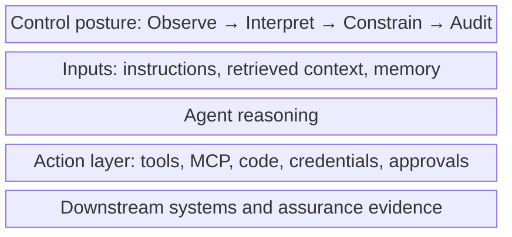

# Landscape Map: Agentic Execution Security

The security boundary for agentic AI is the execution system around the model: the prompts it receives, the context it retrieves, the tools it can call, the credentials it can use, the memory it can update, the code it can write or run, the approvals it can request, and the downstream systems it can affect.

This landscape map gives readers a common frame before moving into the [threat model](01-threat-model.md). It treats agentic systems as execution environments, not as isolated model endpoints.

The diagram below shows the agentic execution system as five stacked layers, with the control posture wrapping every layer. 



Source: [agentic-execution-landscape.mmd](../visuals/agentic-execution-landscape.mmd).

## The Protected Object

In a model-centred system, the protected object is often the prompt, the completion, or the data sent to and from the model. In an agentic system, the protected object is broader: it is the system of action that forms around language, tools, state, identity, and authority.

| Component | Security question |
| --- | --- |
| Instructions | Which messages, prompts, policies, and delegated goals can shape behaviour? |
| Context | Which retrieved documents, data sources, and conversation state influence decisions? |
| Tools | Which functions, APIs, systems, files, and workflows can the agent invoke? |
| Credentials | Which user, service, or delegated authority does the action use? |
| Memory | Which facts, preferences, summaries, and learned state can persist across turns or sessions? |
| Code execution | Which generated scripts, shell commands, notebooks, or automation paths can change systems? |
| Approvals | Which actions require human review, and what evidence does the reviewer see? |
| Downstream systems | Which repositories, SaaS platforms, cloud resources, data stores, and communication channels can be changed? |

The central question is therefore not only whether a model output is safe. It is what the agentic system can do, under whose authority, with which context, through which tools, and under what controls.

## Language As An Execution Layer

Language becomes part of the execution layer when instructions can change action. A prompt, retrieved document, issue comment, ticket, email, chat message, web page, or tool response may influence whether an agent reads data, calls an API, writes code, updates memory, opens a pull request, sends a message, or changes configuration.

This does not mean language is executable in the same way as a binary or script. It means language can participate in execution paths by steering systems that have authority. Security therefore needs to inspect more than text safety. It needs to understand the relationship between instruction, intent, authority, tool choice, data sensitivity, and outcome.

Useful control questions include:

- Which instructions are trusted, untrusted, system-owned, user-owned, or retrieved from external sources?
- Which instructions can override, redirect, or reinterpret the user's goal?
- Which tool calls or memory writes can be triggered by language alone?
- Which actions require policy checks, approval gates, sandboxing, or credential brokering before execution?

## Main Risk Surfaces

Agentic risk appears wherever language, authority, state, and action meet.

| Surface | Failure focus | Control question |
| --- | --- | --- |
| Instruction flow | Untrusted instructions influence goals, policies, or tool choices. | Which instruction sources are allowed to steer behaviour, and which must be treated as data? |
| Retrieved context | External or stale context changes interpretation, priorities, or decisions. | How is context sourced, labelled, filtered, and bounded before use? |
| Tool interfaces | Tools expose unsafe actions, broad parameters, weak validation, or risky composition. | What can each tool do, and how is intent, authority, input, and output checked? |
| Credentials and tokens | Agents act with excessive, unclear, or poorly scoped authority. | Which identity is used for each action, and can credentials be limited per task? |
| Memory | Persistent state stores manipulated facts, preferences, summaries, or instructions. | What may be written to memory, who can influence it, and how is it reviewed or expired? |
| Code and automation | Generated code, scripts, or file operations create side effects beyond the reviewed output. | Where can code run, what can it touch, and what evidence is preserved? |
| MCP, skills, and extensions | Tool servers or packaged capabilities become authority-bearing execution boundaries. | How are capabilities discovered, trusted, configured, monitored, and revoked? |
| Human approvals | Reviewers approve actions without enough context, risk signal, or diff visibility. | What must a reviewer see before approving an action? |
| Multi-agent communication | One compromised agent influences another agent, queue, workflow, or shared memory. | How are messages authenticated, scoped, and constrained across agent boundaries? |
| Monitoring and evaluation | Logs, traces, benchmarks, and tests miss multi-step behaviour and downstream effects. | Can the organisation observe action paths, not only final responses? |

These surfaces overlap. A retrieved document can influence a tool call. A tool response can update memory. A memory entry can affect a later approval request. A token can turn a weak instruction into an organisational action.

## How Failures Compose

Most agentic failures are not single events. They are paths across the execution system.

```text
Untrusted instruction
-> compromised intent
-> risky tool selection
-> delegated authority use
-> persistent state or downstream change
-> broader organisational impact
```

Different systems will expose different paths, but the pattern is consistent: a weak boundary in one place becomes more serious when it is connected to tools, credentials, memory, automation, or other agents.

Common composition patterns include:

- An instruction attack changes how the agent interprets the user's goal, then tool access turns that interpretation into action.
- Poisoned context changes the evidence base, then memory makes the change persistent across sessions.
- Broad credentials allow a narrow task to affect systems outside the user's intended scope.
- A weak approval path lets a human approve an action without seeing the instruction source, tool parameters, or likely impact.
- A compromised tool, skill, or MCP server becomes a bridge between language-level influence and system-level side effects.
- In a multi-agent workflow, one agent's manipulated output becomes another agent's trusted input.

Phase 5 will expand these paths into detailed breach-chain models. This phase establishes the shared landscape and vocabulary.

## Control Posture

Securing agentic systems requires controls that operate across the execution environment:

| Control posture | What it must cover |
| --- | --- |
| Observe | Prompts, retrieved context, tool calls, credential use, memory reads and writes, approvals, outputs, and downstream actions. |
| Interpret | Intent, instruction source, authority, data sensitivity, tool risk, policy fit, and likely outcome. |
| Constrain | Tool permissions, credential scopes, memory writes, code execution, data movement, approval gates, and autonomous actions. |
| Audit | Evidence for review, incident response, assurance, governance, and continuous improvement. |

The [threat model](01-threat-model.md) turns this landscape into specific failure modes and defender questions.