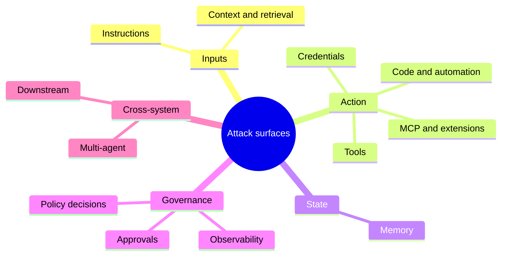

# Attack Surfaces: Agentic Execution Systems

Agentic attack surfaces appear wherever language, context, tools, memory, credentials, code, approvals, policies, and downstream systems meet. They are not only model inputs. They are the places where an instruction, retrieved fact, tool result, stored memory, or delegated permission can influence action.

This document builds on the [landscape map](00-landscape-map.md) and [threat model](01-threat-model.md). It maps the surfaces defenders need to inspect before moving into [agentic attack chains](03-agentic-attack-chains.md).

The aim is defensive: identify where influence enters the execution system, where authority is exercised, where state persists, and where controls can observe, interpret, constrain, and audit behaviour.

## How To Read A Surface

An attack surface in an agentic system should be reviewed as a boundary with four properties:

| Property | Review question |
| --- | --- |
| Influence | What can shape the agent's goal, interpretation, tool choice, or approval request? |
| Authority | Which identity, token, permission, tool, or workflow can turn intent into action? |
| State | What context, memory, file, ticket, queue, or system record can persist or be reused? |
| Evidence | Can reviewers reconstruct the instruction source, decision, action, approval, and outcome? |

A surface becomes high risk when untrusted influence can reach meaningful authority without enough interpretation, constraint, or audit evidence.

The mindmap below groups the twelve surfaces into five families: inputs, action, state, governance, and cross-system. 

Source: [surface-boundary-map.mmd](../visuals/surface-boundary-map.mmd).

## Surface Map

| Surface | What is exposed | Why it matters | Defensive evidence |
| --- | --- | --- | --- |
| Instruction sources | System prompts, user prompts, delegated goals, retrieved instructions, tool responses, comments, tickets, emails, and web pages. | Language can redirect intent or change how the system interprets authority. | Source labels, trust level, instruction precedence, prompt and context trace. |
| Context and retrieval | Documents, search results, embeddings, summaries, snippets, records, and knowledge bases. | Context often becomes the evidence base for action. | Provenance, freshness, sensitivity, retrieval query, ranking, and filtering decisions. |
| Tool interfaces | APIs, functions, plugins, scripts, workflow actions, file operations, and external services. | Tool calls convert language-shaped intent into system side effects. | Tool schema, parameters, caller identity, policy decision, result, and side effect. |
| Credential boundaries | User tokens, service accounts, delegated scopes, API keys, session tokens, and short-lived credentials. | Authority determines the blast radius of a mistaken or manipulated action. | Identity used, scope, lifetime, task binding, approval record, and secret handling. |
| Memory and state | Long-term memory, task state, summaries, preferences, cache, shared notes, queues, and artefacts. | Stored state can make temporary compromise persistent or reusable. | Memory read and write logs, provenance, owner, expiry, review status, and deletion path. |
| Code and automation | Generated code, shell commands, notebooks, CI jobs, deployment scripts, and file changes. | Automation can create effects beyond the text shown to a user. | Diff, command, execution environment, sandbox boundary, output, and rollback path. |
| MCP, skills, and extensions | Tool servers, packaged capabilities, local extensions, remote services, and capability manifests. | Capabilities become authority-bearing execution boundaries. | Version, source, permissions, configuration, tool descriptions, network and file access. |
| Human approvals | Review prompts, approval buttons, pull requests, tickets, change windows, and exception paths. | Humans may approve action without seeing the source of influence or likely impact. | Risk summary, source context, parameters, diff, expected effect, approver identity, and timestamp. |
| Policy decisions | Runtime guardrails, allow lists, deny lists, data handling rules, approval rules, and exception logic. | Policy is where intent, authority, data sensitivity, and impact should be interpreted. | Decision record, matched rule, risk factors, override reason, and audit trail. |
| Observability and evaluation | Logs, traces, metrics, evaluation datasets, alerts, and incident records. | Unobserved paths cannot be governed, tested, or investigated. | Linked trace from instruction to outcome, sampled reviews, evaluation results, and incident evidence. |
| Multi-agent communication | Agent messages, shared tasks, orchestrator queues, shared memory, hand-offs, and delegated work. | One agent's manipulated output can become another agent's trusted input. | Origin, recipient, trust label, delegated scope, shared-state changes, and downstream action. |
| Downstream systems | Repositories, SaaS platforms, cloud resources, data stores, communications, finance, and operational workflows. | Organisational impact occurs when agentic action changes real systems. | Change record, business owner, approval path, rollback evidence, and customer or operational impact. |

## Instruction And Goal Surfaces

Instruction surfaces include direct user messages, system prompts, developer guidance, retrieved text, comments, issue bodies, emails, web pages, tool responses, and agent-to-agent messages. These sources do not carry the same trust level, but agentic systems often merge them into a single reasoning context.

The defensive question is whether the system can tell trusted control instructions from untrusted data. A retrieved document can explain what a system should do, but it should not silently redefine policy, override user intent, or authorise a tool call.

Review these controls:

1. Label instruction sources by origin, trust level, and purpose.
2. Keep user intent separate from retrieved or generated content.
3. Re-check goal alignment before high-impact actions.
4. Treat tool output as evidence unless it is explicitly trusted to instruct behaviour.
5. Preserve enough prompt and context trace for review.

## Context And Retrieval Surfaces

Retrieval expands the model's view of the world, but it also imports source quality, provenance, freshness, and sensitivity problems. A system that retrieves from tickets, repositories, web pages, chats, logs, or knowledge bases may ingest stale, hostile, irrelevant, or over-permissive content.

Context should be treated as evidence with provenance, not as neutral truth. The control boundary is not only the retrieval call; it is the full path from source selection, ranking, filtering, and summarisation to the final decision.

Review these controls:

1. Record source, owner, freshness, sensitivity, and trust level for retrieved context.
2. Separate retrieved instructions from retrieved facts or quotations.
3. Require stronger evidence for sensitive or irreversible actions.
4. Avoid allowing a single unverified source to drive high-impact decisions.
5. Log the retrieval query, selected context, and omitted high-risk context when practical.

## Tool And Workflow Surfaces

Tools turn intent into action. The same tool can be low risk in one context and high risk in another depending on parameters, identity, data sensitivity, and downstream effect.

Tool risk should be evaluated at the call and chain level. A read-only lookup, a summarisation step, and a message-sending tool may combine into a sensitive disclosure path. A file edit, test run, and deployment action may combine into an unauthorised change path.

Review these controls:

1. Define what each tool can read, write, modify, delete, send, purchase, deploy, or approve.
2. Use strict schemas and validation for tool parameters.
3. Bind tool calls to user intent, task scope, identity, and policy.
4. Detect risky tool combinations before they complete.
5. Preserve call parameters, results, side effects, and policy decisions in one trace.

## Credential And Authority Surfaces

Credentials define what an action can affect. In agentic systems, authority may come from a user session, service identity, delegated token, API key, workflow runner, local machine, cloud role, or approval system.

The most important question is whether authority is narrowed to the task before action happens. Broad or reusable credentials make it harder to distinguish intended user action from agent-driven overreach.

Review these controls:

1. Broker credentials per task, action, and approval where possible.
2. Use short-lived, scoped, and auditable authority for tool calls.
3. Keep secrets out of prompts, memory, traces, and model-visible context.
4. Show the effective identity and scope in approval and audit records.
5. Deny actions where the identity, task, or outcome cannot be clearly bound.

## Memory And State Surfaces

Memory can preserve useful continuity, but it can also preserve manipulated facts, hidden instructions, incorrect summaries, stale assumptions, or sensitive data. Shared memory and task artefacts become especially important in multi-agent systems.

Memory writes should be treated as security-relevant state changes. A memory entry may influence future tool calls, approvals, retrieval decisions, or agent-to-agent hand-offs.

Review these controls:

1. Define which categories of content may be stored and which must never be stored.
2. Require provenance, owner, reason, scope, and expiry for memory entries.
3. Log memory reads and writes as part of the action path.
4. Let users or reviewers inspect, correct, expire, and delete memory.
5. Treat shared memory, queues, and summaries as trust boundaries.

## Code, MCP, Skills, And Extensions

Generated code, local commands, MCP servers, skills, extensions, and packaged capabilities are execution boundaries. They may expose file access, network calls, cloud actions, repository changes, build systems, or local secrets.

Capability descriptions are not enough. Defenders need to know what a capability can actually access, which identity it uses, how it is configured, and how it can be revoked.

Review these controls:

1. Review and version capabilities before enabling them in agent workflows.
2. Restrict file, network, cloud, repository, and SaaS access by task.
3. Prefer sandboxed execution for generated code and commands.
4. Log capability selection, parameters, results, and side effects.
5. Maintain revocation, update, and emergency disable paths.

## Approval, Policy, And Observability Surfaces

Approval and policy controls are only useful if they see the right evidence. A reviewer needs more than a final answer; they need the source of the instruction, retrieved evidence, tool parameters, effective identity, expected impact, and rollback path.

Observability must connect the full path. Separate logs for prompts, tools, memory, credentials, approvals, and downstream systems are weaker than a trace that can reconstruct the chain.

Review these controls:

1. Show reviewers source context, risk factors, parameters, diffs, identity, and expected effect.
2. Record policy decisions and exceptions with reasons.
3. Link prompts, retrieved context, tool calls, memory changes, approvals, outputs, and downstream actions.
4. Test multi-step workflows, not only single prompts or final responses.
5. Use audit evidence for assurance and continuous improvement, not only debugging.

## Engineering Patterns Per Surface

Each surface above maps to one or more secure engineering patterns. The patterns describe the boundaries, decision points, audit edges, and deny or revise branches that engineers can build to. Use the [secure engineering patterns overview](07-secure-engineering-patterns.md) for the full map; the table below is the quick lookup.

| Surface | Pattern(s) that address it |
| --- | --- |
| Instruction sources | [Secure Agent Runtime](../patterns/secure-agent-runtime.md) |
| Context and retrieval | [Secure Agent Runtime](../patterns/secure-agent-runtime.md), planned context-poisoning pattern |
| Tool interfaces | [Secure Tool Calling](../patterns/secure-tool-calling.md) |
| Credential boundaries | [Credential And Token Boundaries](../patterns/credential-and-token-boundaries.md) |
| Memory and state | [Memory Security](../patterns/memory-security.md) |
| Code and automation | Planned sandboxing pattern; partially [Secure Tool Calling](../patterns/secure-tool-calling.md) |
| MCP, skills, and extensions | [Secure MCP](../patterns/secure-mcp.md) |
| Human approvals | [Secure Agent Runtime](../patterns/secure-agent-runtime.md), [Secure Tool Calling](../patterns/secure-tool-calling.md), [Credential And Token Boundaries](../patterns/credential-and-token-boundaries.md) |
| Policy decisions | [Secure Agent Runtime](../patterns/secure-agent-runtime.md) |
| Observability and evaluation | [Secure Agent Runtime](../patterns/secure-agent-runtime.md) end-to-end trace; audit evidence sections in all five patterns |
| Multi-agent communication | Planned multi-agent pattern |
| Downstream systems | [Secure Tool Calling](../patterns/secure-tool-calling.md) outcome control, [Credential And Token Boundaries](../patterns/credential-and-token-boundaries.md) |

## Composition Review

Surface review should end by asking how local weaknesses can compose.

| Composition path | What to check |
| --- | --- |
| Untrusted instruction -> tool call | Can external language trigger action without a task-bound policy decision? |
| Retrieved context -> approval request | Does the approver see source, trust level, and uncertainty? |
| Tool response -> memory write | Can a transient result become persistent trusted state? |
| Broad token -> workflow action | Is authority limited to the intended task and outcome? |
| Generated code -> deployment path | Can code execution reach systems outside the reviewed scope? |
| Agent message -> second agent action | Are origin, delegated scope, and trust level preserved across agents? |
| Weak trace -> incident review | Can the organisation reconstruct what happened and why? |

The next document, [Agentic Attack Chains](03-agentic-attack-chains.md), shows how these surfaces combine into breach paths and where defenders can interrupt them.