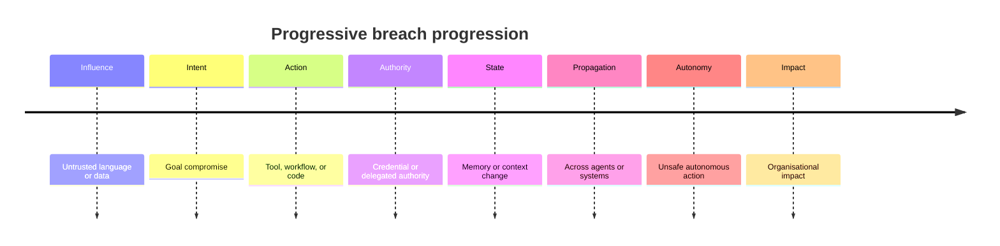
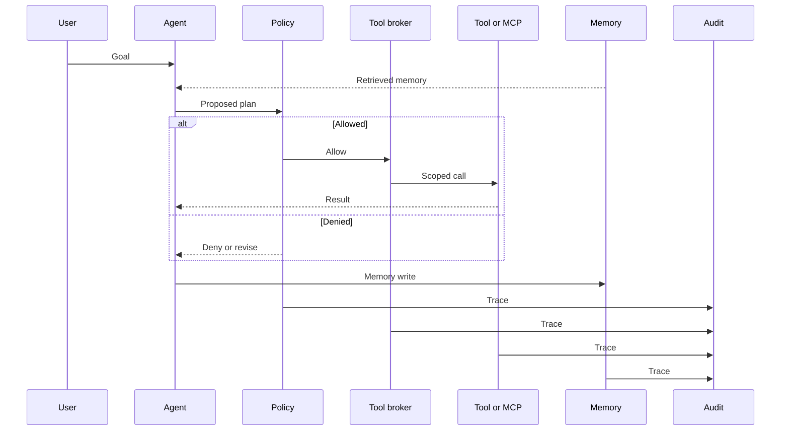

# Agentic Attack Chains: From Influence To Impact

Agentic attack chains describe how local weaknesses compose into organisational impact. The risk is rarely a single prompt, response, or tool call. It is the path from influence, to intent, to authority, to state, to action, to impact.

This document is a defensive model. It does not provide operational exploit instructions. It helps teams identify where a chain can start, how it can move across the execution system, what evidence should be preserved, and where controls should interrupt the path.

For the surface map behind these chains, read [Attack Surfaces: Agentic Execution Systems](02-attack-surfaces.md). For the underlying failure modes, read the [threat model](01-threat-model.md).

## Progressive Breach Model

Agentic breach chains often follow this progression:

```text
Untrusted language or data
-> intent or goal compromise
-> tool, workflow, or code action
-> credential or delegated authority use
-> memory, state, or context change
-> propagation across agents or systems
-> unsafe autonomous action
-> organisational impact
```

The breach progression below shows eight chronological stages from untrusted input to organisational impact.



Source: [progressive-breach-model.mmd](../visuals/progressive-breach-model.mmd).

Not every incident follows every stage. Some chains stop at unsafe disclosure or misleading advice. Others skip memory or multi-agent propagation. The model is useful because it makes defenders ask where influence becomes action and where action becomes durable impact.

## Chain Stages

| Stage | What changes | Control opportunity | Evidence to preserve |
| --- | --- | --- | --- |
| Influence enters | User input, retrieved text, tool output, message, ticket, email, or web content affects reasoning. | Label source, trust level, freshness, and sensitivity. | Prompt, source metadata, retrieval query, tool result, or message origin. |
| Intent shifts | The agent reinterprets the goal, prioritises a competing objective, or hides risk. | Keep user intent separate and re-check alignment before action. | User goal, planning trace, policy decision, and risk explanation. |
| Boundary is crossed | The agent selects a tool, workflow, code path, MCP server, skill, extension, or second agent. | Validate tool choice against task, identity, data sensitivity, and expected outcome. | Tool selection reason, parameters, capability metadata, and policy result. |
| Authority is used | A token, service identity, user session, approval, or delegated permission enables action. | Broker credentials and require scoped, task-bound authority. | Effective identity, scope, lifetime, approval, and secret-handling record. |
| State changes | Memory, files, tickets, repositories, queues, summaries, or downstream records are updated. | Review, scope, expire, and audit state changes. | Diff, memory write, state owner, provenance, and rollback path. |
| Propagation occurs | Another agent, workflow, human, or system treats manipulated output as trusted input. | Authenticate and label cross-agent messages and shared artefacts. | Sender, recipient, task scope, shared state, and downstream action trace. |
| Impact lands | Data, code, cloud resources, communications, financial processes, operations, or customers are affected. | Apply outcome controls, approval gates, rollback, and incident response. | Final action, business owner, customer or operational effect, and remediation record. |

## Chain Pattern 1: Instruction Influence To Tool Action

In this pattern, untrusted language changes how the agent interprets the user's goal. The agent then selects a tool or workflow that can affect a real system.

Defensive concern: the system treats instruction-like text as control input even though it came from an untrusted source.

Control points:

1. Mark external language as data unless it is explicitly trusted to instruct behaviour.
2. Compare the planned tool call with the user's original goal.
3. Require policy review for tools that write, delete, send, deploy, approve, or change configuration.
4. Preserve the source text, tool parameters, policy result, and downstream effect in one trace.

Merge-ready evidence: reviewers can see why the action was selected, which source influenced it, which authority was used, and why the action matched the user's approved intent.

## Chain Pattern 2: Poisoned Context To Misleading Approval

In this pattern, retrieved context supplies misleading evidence. The agent uses that evidence to justify an approval request or a sensitive recommendation.

Defensive concern: the human approver sees a confident summary but not the provenance, freshness, trust level, or uncertainty behind it.

Control points:

1. Attach source, freshness, sensitivity, and trust labels to retrieved evidence.
2. Require multiple or higher-trust sources for high-impact actions.
3. Show the approver the relevant context, the uncertainty, and the expected effect.
4. Log the approval decision with the evidence available at the time.

Merge-ready evidence: the approval record includes what the reviewer saw, which sources supported the decision, and how the system handled uncertainty.

## Chain Pattern 3: Tool Result To Memory Persistence

In this pattern, a temporary tool response or external message becomes stored memory. Later, the agent retrieves that memory as trusted context and uses it to guide action.

Defensive concern: a short-lived influence becomes persistent state without provenance, review, or expiry.

Control points:

1. Treat memory writes as state changes, not as harmless notes.
2. Require provenance, owner, scope, reason, and expiry for memory entries.
3. Prevent secrets, policy overrides, and untrusted behavioural instructions from entering memory.
4. Log future memory reads that influence tool calls, approvals, or decisions.

Merge-ready evidence: memory entries can be inspected, corrected, expired, deleted, and tied back to the source that created them.

## Chain Pattern 4: Broad Authority To Downstream Change

In this pattern, the agent acts through credentials that are broader than the task requires. A narrow request can therefore affect repositories, cloud resources, SaaS records, customer communications, or operational workflows outside the intended scope.

Defensive concern: the system cannot prove that authority was limited to the approved task and expected outcome.

Control points:

1. Broker credentials per task, action, and approval.
2. Use short-lived scopes and deny actions outside the approved boundary.
3. Show effective identity, scope, and expected effect before high-impact actions.
4. Preserve audit evidence that connects identity, policy, approval, and outcome.

Merge-ready evidence: each downstream change can be traced to a task-bound identity, explicit scope, policy decision, and approval record where required.

## Chain Pattern 5: Cross-Agent Propagation

In this pattern, one agent's output becomes another agent's input through a queue, shared memory, ticket, comment, orchestration system, or delegated task. The receiving agent treats the content as trusted enough to act.

Defensive concern: trust labels, scope, and authority are lost when work moves between agents.

Control points:

1. Authenticate agent-to-agent messages and label origin, trust level, and delegated scope.
2. Prevent one agent from silently granting authority or policy exceptions to another.
3. Treat shared memory, task artefacts, and queues as boundaries.
4. Link traces across agents so incident review can reconstruct the full path.

Merge-ready evidence: the organisation can show which agent produced an artefact, which agent consumed it, what authority was delegated, and what downstream action followed.

## Chain Pattern 6: Observability Gap To Repeated Failure

In this pattern, the organisation cannot connect prompts, retrieved context, tool calls, memory changes, credentials, approvals, and downstream actions. The incident may be noticed only after impact, and the same weakness can recur because the path is not visible.

Defensive concern: governance relies on final outputs or isolated logs rather than a reconstructable action path.

Control points:

1. Link prompt, context, tool, credential, memory, approval, output, and downstream-action records.
2. Review traces for multi-step behaviour and risky tool combinations.
3. Test workflows that include memory, tools, approvals, autonomy, and agent-to-agent hand-offs.
4. Use incident evidence to improve policies, evaluations, and approval design.

Merge-ready evidence: reviewers can reconstruct what happened, why it was allowed, what changed, and which control should prevent recurrence.

## Interruption Checklist

For any proposed agentic workflow, ask where the chain would be interrupted:

1. Can untrusted language be prevented from becoming control instruction?
2. Can goal alignment be checked before a risky tool call?
3. Can policy decisions evaluate intent, authority, data sensitivity, and likely impact together?
4. Can credentials be scoped to the task and revoked after use?
5. Can memory writes be reviewed, expired, corrected, and traced?
6. Can cross-agent messages preserve origin, trust level, and delegated scope?
7. Can humans see enough evidence before approving sensitive action?
8. Can the full path from influence to outcome be reconstructed after the fact?

If the answer is unclear, the system is difficult to govern even if the model appears safe in isolation.

## Engineering Patterns That Implement Each Interruption

Each interruption question above maps to one or more secure engineering patterns. The patterns describe the boundaries, decision points, audit edges, and deny or revise branches that engineers can build to. Use the [secure engineering patterns overview](07-secure-engineering-patterns.md) for the full map; the table below is the quick lookup.

| Interruption question | Pattern(s) |
| --- | --- |
| Can untrusted language be prevented from becoming control instruction? | [Secure Agent Runtime](../patterns/secure-agent-runtime.md), [Memory Security](../patterns/memory-security.md), [Secure MCP](../patterns/secure-mcp.md) |
| Can goal alignment be checked before a risky tool call? | [Secure Agent Runtime](../patterns/secure-agent-runtime.md), [Secure Tool Calling](../patterns/secure-tool-calling.md) |
| Can policy decisions evaluate intent, authority, data sensitivity, and likely impact together? | [Secure Agent Runtime](../patterns/secure-agent-runtime.md), [Secure Tool Calling](../patterns/secure-tool-calling.md) |
| Can credentials be scoped to the task and revoked after use? | [Credential And Token Boundaries](../patterns/credential-and-token-boundaries.md) |
| Can memory writes be reviewed, expired, corrected, and traced? | [Memory Security](../patterns/memory-security.md) |
| Can cross-agent messages preserve origin, trust level, and delegated scope? | Planned multi-agent pattern |
| Can humans see enough evidence before approving sensitive action? | [Secure Agent Runtime](../patterns/secure-agent-runtime.md), [Secure Tool Calling](../patterns/secure-tool-calling.md) |
| Can the full path from influence to outcome be reconstructed after the fact? | [Secure Agent Runtime](../patterns/secure-agent-runtime.md), audit evidence sections in all five patterns |


## Relationship To Defence Architecture

These chains show where controls need to operate. The [defence architecture](04-defence-architecture.md) organises those controls into layers for identity, policy decisions, runtime guardrails, tool brokering, credential brokering, memory and context controls, observability, human approval, audit, outcome control, and governance.

The interaction between agent, policy, tool broker, tools, memory, and audit is shown below as a sequence diagram. The diagram is about who calls whom and in what order.



Source: [agent-tool-memory-attack-flow.mmd](../visuals/agent-tool-memory-attack-flow.mmd).
