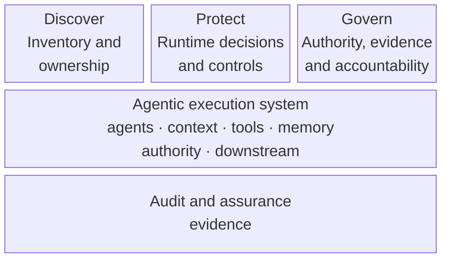
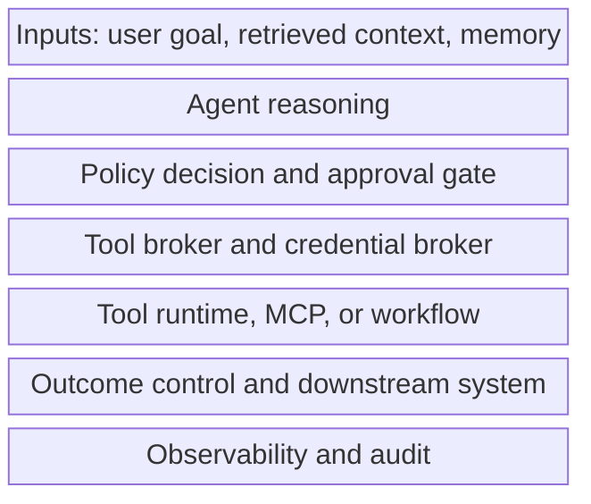
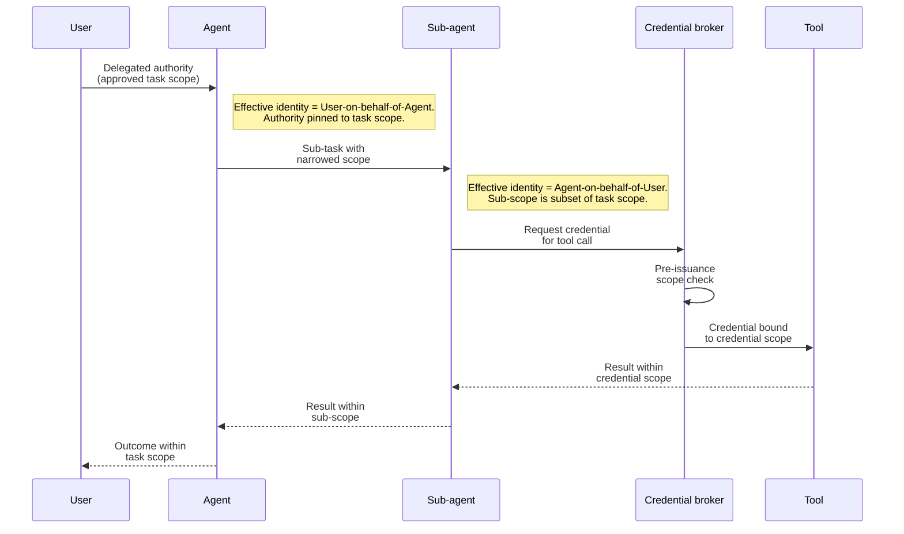
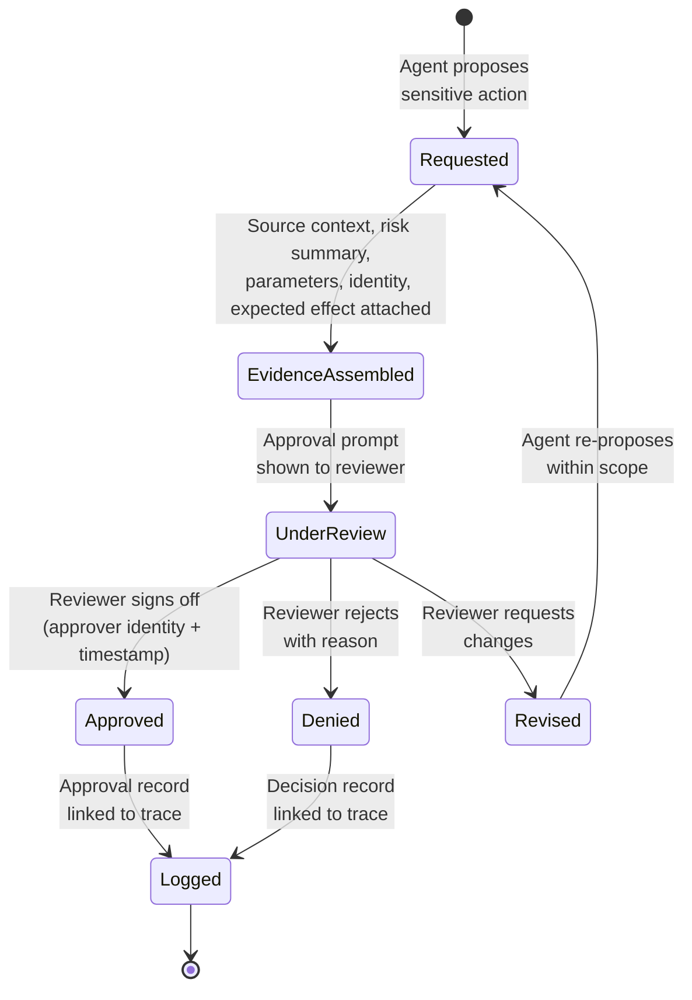
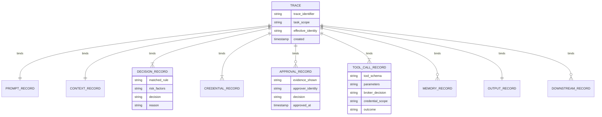

# Defence Architecture: Securing Agentic Execution

Agentic systems need defence architecture because their risk is not confined to a model response. Prompts, retrieved context, tool calls, credentials, memory, code execution, approvals, and downstream systems can all participate in action.

This document builds on the [attack surface map](02-attack-surfaces.md) and [agentic attack chains](03-agentic-attack-chains.md). It organises the controls that help teams observe, interpret, constrain, and audit behaviour as it unfolds.

The aim is not to describe a single product pattern. It is to define the control layers a secure agentic execution system should make explicit.

## Architecture Principle

The core architectural principle is:

> No meaningful action should happen without enough context to understand the intent, authority, risk, policy fit, and expected outcome.

That principle applies before a tool call, during execution, after a result returns, and when the system writes memory or affects a downstream system.

The defence architecture should answer five questions:

| Question | Why it matters |
| --- | --- |
| What is influencing the agent? | Prompts, retrieved context, tool results, memory, and other agents can all shape behaviour. |
| What can the agent do? | Tools, workflows, code execution, and downstream systems define the action surface. |
| Under whose authority? | User sessions, service accounts, delegated tokens, and approvals determine blast radius. |
| Which policy applies? | Risk depends on intent, data sensitivity, tool capability, identity, and likely outcome together. |
| What evidence remains? | Governance, incident response, assurance, and improvement require a reconstructable action path. |

## Control Loop

The runtime security model has four connected capabilities.

| Capability | What it does | Evidence it should preserve |
| --- | --- | --- |
| Observe | Captures prompts, context, memory reads and writes, tool calls, approvals, outputs, and downstream actions. | Source labels, trace identifiers, selected context, tool parameters, effective identity, action result, and downstream change. |
| Interpret | Assesses user intent, instruction source, data sensitivity, tool risk, delegated authority, policy fit, and likely impact. | Risk factors, matched rules, confidence or uncertainty, policy decision, and explanation shown to reviewers. |
| Constrain | Limits action through policy decisions, tool brokers, credential brokers, sandboxing, approval gates, and outcome controls. | Allow, deny, revise, require approval, narrow scope, or rollback decision with reason. |
| Audit | Preserves the chain from influence to outcome for review, assurance, incident response, and continuous improvement. | Linked prompt, context, decision, credential, approval, tool, memory, output, and downstream records. |

These capabilities should not be isolated systems. Observation without interpretation becomes storage. Interpretation without constraint becomes advice. Constraint without audit becomes hard to trust. Audit without runtime control arrives too late.

## AI Defense Plane

The AI Defense Plane organises controls into three operating layers: Discover, Protect, and Govern. 

Source: [ai-defense-plane.mmd](../visuals/ai-defense-plane.mmd).

| Layer | Responsibility | Examples |
| --- | --- | --- |
| Discover | Find and classify agents, tools, prompts, data flows, credentials, memory, workflows, owners, and downstream systems. | Agent catalogue, tool registry, data-flow map, memory inventory, authority map, ownership record. |
| Protect | Control inputs, retrieved context, memory writes, tool calls, credentials, code execution, approvals, and autonomous action. | Runtime guardrails, policy decisions, tool brokers, credential brokers, sandboxing, approval gates, outcome controls. |
| Govern | Manage delegated authority, policy exceptions, audit trails, assurance evidence, accountability, and compliance obligations. | Review cadence, risk acceptance, audit evidence, evaluation evidence, exception handling, incident records. |

Discover shows what exists. Protect decides and enforces what can happen. Govern makes authority, evidence, accountability, and improvement durable.

## Layered Control Model

A secure agentic architecture needs several control layers that share context. Each layer should be designed as part of the action path, not added only at the final output.

| Layer | Responsibility | Control question | Evidence to keep |
| --- | --- | --- | --- |
| Identity and access | Identify the user, agent, service, tool, workflow, and downstream system involved in an action. | Is this identity allowed to request this action for this task? | Effective identity, role, scope, owner, delegated authority, and session or token lifetime. |
| Policy decision | Evaluate intent, source trust, data sensitivity, tool risk, authority, and expected impact. | Should this action be allowed, denied, revised, or escalated for approval? | Matched rule, risk factors, decision, reason, exception, and reviewer-facing explanation. |
| Runtime guardrail | Inspect inputs, context, generated plans, tool parameters, outputs, and memory writes while execution is happening. | Is the current step still aligned with the approved task and policy? | Detection, transformation, blocked content, revised plan, and trace link. |
| Tool broker | Mediate tool, API, workflow, MCP server, skill, extension, file, and command execution. | Is this tool call valid, scoped, and expected for this task? | Tool schema, parameters, caller, policy result, result, side effect, and retry or rollback path. |
| Credential broker | Issue or bind credentials for a specific task, action, tool, and approval boundary. | Is the authority narrower than the approved outcome requires? | Credential type, scope, lifetime, binding, secret-handling decision, and revocation record. |
| Memory and context | Control retrieval, summarisation, context injection, memory reads, and memory writes. | Can this context or memory safely influence future action? | Source, provenance, freshness, sensitivity, trust level, owner, expiry, and write reason. |
| Observability and audit | Link prompts, context, decisions, tools, credentials, approvals, memory, outputs, and downstream effects. | Can a reviewer reconstruct what happened and why? | End-to-end trace, decision log, approval record, state change, outcome, and incident evidence. |
| Human approval | Require informed review for sensitive, irreversible, ambiguous, or high-impact actions. | Does the reviewer see enough evidence to approve the action responsibly? | Source context, risk summary, parameters, identity, expected effect, approver, timestamp, and decision. |
| Outcome control | Limit, verify, reverse, or contain downstream effects after action is attempted. | Did the result match the approved intent and acceptable impact? | Final state, validation result, notification, rollback, containment, and business owner record. |

The reference architecture below shows the same layered control model as seven stacked components. The [agent, tool, and memory attack flow](../visuals/agent-tool-memory-attack-flow.mmd) sequence diagram already covers ordering.

Source: [secure-agent-reference-architecture.mmd](../visuals/secure-agent-reference-architecture.mmd).

## How The Layers Work Together

The layers are strongest when they operate as one action path:

1. A user goal or delegated task enters with source, identity, and scope.
2. Context and memory are retrieved with provenance, sensitivity, freshness, and trust labels.
3. The agent proposes a plan or tool call.
4. The policy layer interprets intent, authority, data sensitivity, tool risk, and likely impact.
5. The runtime guardrail checks whether the proposed step still matches the approved task.
6. The tool broker validates the tool, parameters, schema, and expected side effect.
7. The credential broker issues only the authority needed for the approved action.
8. A human approval gate receives source context, risk, identity, parameters, and expected effect when the action is sensitive or ambiguous.
9. The downstream action is executed, constrained, verified, and logged.
10. Memory writes and future context changes are reviewed as state changes, not as harmless notes.
11. Observability and audit link the full path from influence to outcome.

If any step cannot explain its decision, scope, or evidence, the system is difficult to govern.

## Control Escalation

Not every action needs the same control strength. The architecture should escalate controls as risk rises.

| Risk signal | Useful escalation |
| --- | --- |
| Untrusted or mixed-trust instruction source | Source labelling, instruction separation, and goal alignment check. |
| Sensitive retrieved context | Provenance, freshness, sensitivity labels, and stronger evidence requirements. |
| Write, delete, send, deploy, approve, or purchase capability | Policy decision, tool broker validation, scoped credential, and audit trace. |
| Broad or reusable authority | Credential brokering, short lifetime, task binding, and revocation path. |
| Durable memory or shared state write | Provenance, owner, reason, expiry, reviewer visibility, and deletion path. |
| Cross-agent hand-off | Origin, recipient, delegated scope, trust label, and linked trace. |
| Irreversible or high-impact outcome | Human approval, outcome verification, rollback or containment plan, and business owner record. |

The important design choice is to evaluate risk from the relationship between intent, authority, data, tool, and outcome rather than from the model output alone.

## Identity And Delegation

Authority in an agentic system rarely flows in a straight line from the user. A user delegates a task scope to an agent; the agent narrows that scope into sub-tasks for sub-agents or tool calls; a credential broker issues short-lived authority bound to each step. At every hand-off, the *effective identity* and the *credential scope* should be narrower than what came before — never broader.

Source: [identity-delegation-boundary.mmd](../visuals/identity-delegation-boundary.mmd). The diagram makes three things explicit: effective identity changes at every hand-off and is recorded, the credential broker is the enforcement point where scope narrowing actually happens, and the outcome that returns to the user must remain within the original task scope.

## Human Approval Gates

Human approval is a control only when the reviewer can see the evidence needed to make a decision. A button after a confident summary is not enough.

Approval prompts should show:

1. The original user goal or delegated task.
2. The source and trust level of influential context.
3. The proposed action, parameters, and downstream system.
4. The effective identity and credential scope.
5. The matched policy, risk factors, and uncertainty.
6. The expected effect, rollback path, and business owner where relevant.

Approval should be required for actions that are sensitive, irreversible, outside normal scope, ambiguous, high-impact, or dependent on weak evidence.

The lifecycle of an approval request moves through six explicit states. 

Source: [approval-gate.mmd](../visuals/approval-gate.mmd). The diagram makes the difference between *Approved* and *Logged* explicit: an approval is not complete until the approval record (with evidence shown, approver identity, decision, and timestamp) is linked to the task trace.

## Outcome Control

Access control decides whether an actor may attempt an action. Outcome control checks whether the resulting state is acceptable.

Agentic systems need both. A tool call may be authorised but still produce an unsafe result because the context was stale, the parameters were wrong, a downstream system behaved unexpectedly, or the action combined with other steps.

Outcome controls can include:

1. Dry runs, previews, diffs, and staged execution.
2. Post-action validation against the approved intent.
3. Rate limits, spending limits, blast-radius limits, and data-transfer limits.
4. Rollback, quarantine, or compensating actions.
5. Alerts when the observed result differs from the expected result.

This is where the architecture connects access control with organisational impact.

## Observability And Audit Trail

The audit layer is what makes an agentic system reconstructable. A single *trace identifier* should bind the full set of stage records produced during a task — prompt, context, decision, credential, approval, tool call, memory, output, and downstream effect — so a reviewer can follow the chain from influence to outcome without stitching logs across systems.

Source: [observability-audit-trail.mmd](../visuals/observability-audit-trail.mmd). Approval and downstream records are optional (`o{`) because not every task needs an approval or has a downstream side effect; everything else is required so that a reviewer can always reconstruct the action path.

## Architecture Review Questions

Use these questions when reviewing an agentic system:

1. Can the system distinguish trusted control instructions from untrusted data?
2. Can reviewers see which context, memory, or tool result influenced the action?
3. Is every tool call bound to a user goal, identity, policy decision, and expected outcome?
4. Are credentials scoped to the task, short-lived, and auditable?
5. Are memory writes treated as state changes with provenance, owner, reason, and expiry?
6. Do approval gates show source context, risk, parameters, identity, and expected effect?
7. Can cross-agent messages preserve origin, trust level, delegated scope, and downstream action?
8. Can the system deny or revise actions when intent, authority, policy, or outcome is unclear?
9. Can the organisation reconstruct the path from influence to outcome after an incident?
10. Do evaluations test multi-step behaviour across tools, memory, approvals, and downstream systems?

If these answers are weak, the architecture may appear controlled at the model boundary while remaining exposed across the execution system.

## Engineering Patterns Per Control Layer

Each control layer above is the architectural placeholder for one or more secure engineering patterns. The patterns describe the same controls at the boundary, decision, audit, and deny or revise level engineers can build to. Use the [secure engineering patterns overview](07-secure-engineering-patterns.md) for the full map; the table below is the quick lookup.

| Layer | Pattern(s) that implement it |
| --- | --- |
| Identity and access | [Credential And Token Boundaries](../patterns/credential-and-token-boundaries.md) |
| Policy decision | [Secure Agent Runtime](../patterns/secure-agent-runtime.md), [Secure Tool Calling](../patterns/secure-tool-calling.md) |
| Runtime guardrail | [Secure Agent Runtime](../patterns/secure-agent-runtime.md) |
| Tool broker | [Secure Tool Calling](../patterns/secure-tool-calling.md), [Secure MCP](../patterns/secure-mcp.md) |
| Credential broker | [Credential And Token Boundaries](../patterns/credential-and-token-boundaries.md) |
| Memory and context | [Memory Security](../patterns/memory-security.md) |
| Observability and audit | [Secure Agent Runtime](../patterns/secure-agent-runtime.md); audit evidence sections in all five patterns |
| Human approval | [Secure Agent Runtime](../patterns/secure-agent-runtime.md), [Secure Tool Calling](../patterns/secure-tool-calling.md), [Credential And Token Boundaries](../patterns/credential-and-token-boundaries.md) |
| Outcome control | [Secure Tool Calling](../patterns/secure-tool-calling.md), [Secure Agent Runtime](../patterns/secure-agent-runtime.md) |

The [secure engineering patterns overview diagram](../visuals/secure-engineering-patterns-overview.mmd) shows the same composition on a single picture: where this layered model places the decision points, the patterns name the engineering boundary that owns them.

## Relationship To The Field Guide

This architecture turns the earlier risk map into a defence model. The [landscape map](00-landscape-map.md) explains why the boundary has moved, the [threat model](01-threat-model.md) names the failure modes, the [attack surface map](02-attack-surfaces.md) shows where risk enters, and [agentic attack chains](03-agentic-attack-chains.md) show how local weaknesses compose.

The defence architecture explains where controls should sit so those chains can be interrupted, investigated, and improved.
