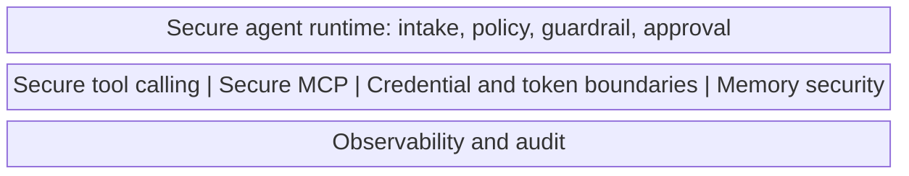

# Secure Engineering Patterns: From Defence Architecture To Code

Secure engineering patterns are the implementation layer of the field guide. The earlier docs explain why agentic systems change risk ([landscape map](00-landscape-map.md)), how they fail ([threat model](01-threat-model.md)), where the failures enter ([attack surfaces](02-attack-surfaces.md)), how local weaknesses compose ([attack chains](03-agentic-attack-chains.md)), and which control layers should sit in the system ([defence architecture](04-defence-architecture.md)). This document closes the loop by connecting those control layers to reusable patterns engineers can build to.

The mission is explicit on this connection:

> Connect threats to practical defence architecture and secure engineering patterns.

Patterns sit at the level where decisions become code. They are not vendor blueprints. They define the shape of the controls — the boundaries, decision points, audit edges, and deny or revise branches — that make an agentic system observable, interpretable, constrainable, and governable in line with the runtime security model in [defence architecture](04-defence-architecture.md).

## Pattern Set

Five patterns cover the boundaries where agentic risk most often becomes action. Each pattern follows the same shape: context, risk, recommended controls, boundary diagram, implementation notes, failure modes covered, evaluation checks, audit evidence, and limitations.

| Pattern | One-line summary | Primary failure modes addressed |
| --- | --- | --- |
| [Secure Agent Runtime](../patterns/secure-agent-runtime.md) | The pipeline of named stages around the agent reasoning step that observe, interpret, constrain, and audit every proposed action. | Prompt and instruction attacks; goal hijacking; unsafe autonomous action; monitoring and evaluation blind spots. |
| [Secure Tool Calling](../patterns/secure-tool-calling.md) | A tool broker mediates every call with allowlist, schema validation, policy decision, scoped credential, output validation, and outcome control. | Tool misuse and unsafe composition; instruction attacks reaching action; unsafe autonomous action. |
| [Secure MCP And Capability Governance](../patterns/secure-mcp.md) | A registry, server authentication, capability scope check, context isolation filter, and response validation around every MCP server, skill, or extension. | MCP, skill, and extension compromise; tool misuse via packaged capabilities; context poisoning via capability responses. |
| [Memory Security](../patterns/memory-security.md) | Classification on write, provenance and expiry tags, read policy, freshness and source filter, and anomaly detection around every memory entry. | Memory poisoning; secret persistence; context poisoning via memory recall. |
| [Credential And Token Boundaries](../patterns/credential-and-token-boundaries.md) | A credential broker issues task-bound, least-privilege, short-lived tokens from vault-backed secrets, with secret filters on outputs and exercised revocation paths. | Credential and token misuse; authority over-grant; multi-agent propagation via shared identity. |

These five compose. The runtime pattern enforces that tool calls go through the tool broker, that capabilities come from the registry, that memory writes pass classification, and that credentials are brokered. None of the four sibling patterns can be safely bypassed if the runtime is implemented well. The runtime cannot replace any of them.

## How The Patterns Compose

The overview diagram shows the five patterns operating around the secure agent reference architecture in a single picture. Read it as the engineering view of the [secure agent reference architecture](../visuals/secure-agent-reference-architecture.mmd): the architecture says where decisions sit, the overview says which pattern owns each decision.

Source: [secure-engineering-patterns-overview.mmd](../visuals/secure-engineering-patterns-overview.mmd). 

A request moves through:

1. **Runtime intake.** The runtime pattern pins task scope, identity, allowlist, and trace identifier.
2. **Reasoning.** The agent proposes a step using source-labelled context.
3. **Policy decision.** The runtime evaluates the proposed step against intent, identity, and risk.
4. **Tool path.** The tool broker validates allowlist and schema; the credential broker issues a scoped token; the MCP capability is authenticated and scope-checked; the context isolation filter narrows what crosses the host-to-server boundary.
5. **Action.** The tool runtime or MCP server executes; output is validated and quarantined where needed; outcome control sits between the runtime and the downstream system.
6. **Memory.** Memory writes are classified, tagged, and policy-checked; reads are filtered and source-labelled.
7. **Audit.** Every stage emits to the audit channel under the same trace identifier.

Every path has a deny, revise, or escalate branch in addition to allow. Every path has an audit edge. This is the contract patterns place on the implementation.

## Threat And Surface To Pattern Map

The mapping below ties the failure-mode taxonomy in [threat model](01-threat-model.md) and the surface map in [attack surfaces](02-attack-surfaces.md) to the patterns that address them. Use this as a starting checklist when reviewing a system, not as a substitute for the controls in each pattern.

### Failure modes to patterns

| Failure mode (from 01-threat-model) | Primary pattern(s) | Supporting pattern(s) |
| --- | --- | --- |
| 1. Prompt and instruction attacks | [Secure Agent Runtime](../patterns/secure-agent-runtime.md) | [Memory Security](../patterns/memory-security.md), [Secure MCP](../patterns/secure-mcp.md) |
| 2. Goal hijacking | [Secure Agent Runtime](../patterns/secure-agent-runtime.md) | [Secure Tool Calling](../patterns/secure-tool-calling.md) |
| 3. Tool misuse and unsafe composition | [Secure Tool Calling](../patterns/secure-tool-calling.md) | [Secure Agent Runtime](../patterns/secure-agent-runtime.md), [Credential And Token Boundaries](../patterns/credential-and-token-boundaries.md) |
| 4. Credential and token misuse | [Credential And Token Boundaries](../patterns/credential-and-token-boundaries.md) | [Secure Tool Calling](../patterns/secure-tool-calling.md), [Memory Security](../patterns/memory-security.md) |
| 5. Context poisoning | [Memory Security](../patterns/memory-security.md) (recall path); planned context-poisoning pattern | [Secure Agent Runtime](../patterns/secure-agent-runtime.md), [Secure MCP](../patterns/secure-mcp.md) |
| 6. Memory poisoning | [Memory Security](../patterns/memory-security.md) | [Secure Agent Runtime](../patterns/secure-agent-runtime.md) |
| 7. MCP, skill, and extension compromise | [Secure MCP](../patterns/secure-mcp.md) | [Secure Tool Calling](../patterns/secure-tool-calling.md), [Credential And Token Boundaries](../patterns/credential-and-token-boundaries.md) |
| 8. Multi-agent propagation | Planned multi-agent pattern | [Credential And Token Boundaries](../patterns/credential-and-token-boundaries.md) (per-task identity), [Memory Security](../patterns/memory-security.md) (namespace isolation) |
| 9. Unsafe autonomous action | [Secure Agent Runtime](../patterns/secure-agent-runtime.md) (stop conditions, approvals, outcome control) | [Secure Tool Calling](../patterns/secure-tool-calling.md), [Credential And Token Boundaries](../patterns/credential-and-token-boundaries.md) |
| 10. Monitoring and evaluation blind spots | [Secure Agent Runtime](../patterns/secure-agent-runtime.md) (end-to-end trace) | All four siblings contribute audit evidence sections |

### Attack surfaces to patterns

| Surface (from 02-attack-surfaces) | Pattern(s) that address it |
| --- | --- |
| Instruction sources | [Secure Agent Runtime](../patterns/secure-agent-runtime.md) |
| Context and retrieval | [Secure Agent Runtime](../patterns/secure-agent-runtime.md), planned context-poisoning pattern |
| Tool interfaces | [Secure Tool Calling](../patterns/secure-tool-calling.md) |
| Credential boundaries | [Credential And Token Boundaries](../patterns/credential-and-token-boundaries.md) |
| Memory and state | [Memory Security](../patterns/memory-security.md) |
| Code and automation | Planned sandboxing and code execution pattern; partially [Secure Tool Calling](../patterns/secure-tool-calling.md) |
| MCP, skills, and extensions | [Secure MCP](../patterns/secure-mcp.md) |
| Human approvals | [Secure Agent Runtime](../patterns/secure-agent-runtime.md), [Secure Tool Calling](../patterns/secure-tool-calling.md), [Credential And Token Boundaries](../patterns/credential-and-token-boundaries.md) |
| Policy decisions | [Secure Agent Runtime](../patterns/secure-agent-runtime.md) |
| Observability and evaluation | [Secure Agent Runtime](../patterns/secure-agent-runtime.md) (audit evidence sections in all five patterns) |
| Multi-agent communication | Planned multi-agent pattern |
| Downstream systems | [Secure Tool Calling](../patterns/secure-tool-calling.md) (outcome control), [Credential And Token Boundaries](../patterns/credential-and-token-boundaries.md) |

### Chain interruptions to patterns

The interruption checklist in [attack chains](03-agentic-attack-chains.md) lists eight defensive questions. Patterns map to those questions as follows:

| Interruption question | Pattern(s) |
| --- | --- |
| Can untrusted language be prevented from becoming control instruction? | [Secure Agent Runtime](../patterns/secure-agent-runtime.md), [Memory Security](../patterns/memory-security.md), [Secure MCP](../patterns/secure-mcp.md) |
| Can goal alignment be checked before a risky tool call? | [Secure Agent Runtime](../patterns/secure-agent-runtime.md), [Secure Tool Calling](../patterns/secure-tool-calling.md) |
| Can policy decisions evaluate intent, authority, data sensitivity, and likely impact together? | [Secure Agent Runtime](../patterns/secure-agent-runtime.md), [Secure Tool Calling](../patterns/secure-tool-calling.md) |
| Can credentials be scoped to the task and revoked after use? | [Credential And Token Boundaries](../patterns/credential-and-token-boundaries.md) |
| Can memory writes be reviewed, expired, corrected, and traced? | [Memory Security](../patterns/memory-security.md) |
| Can cross-agent messages preserve origin, trust level, and delegated scope? | Planned multi-agent pattern |
| Can humans see enough evidence before approving sensitive action? | [Secure Agent Runtime](../patterns/secure-agent-runtime.md), [Secure Tool Calling](../patterns/secure-tool-calling.md) |
| Can the full path from influence to outcome be reconstructed after the fact? | [Secure Agent Runtime](../patterns/secure-agent-runtime.md) (linked trace), audit evidence sections in all five patterns |

## Reader Paths

The five patterns are written so different readers can pick up the parts they need without reading the whole set. Suggested reading orders:

- **AI leaders and CTOs.** Start with [00 landscape map](00-landscape-map.md) and [04 defence architecture](04-defence-architecture.md). Then read this document and the context, risk, and limitations sections of each pattern. The aim is to understand which boundaries the engineering layer must enforce and what the residual risk looks like.
- **AI engineers and security engineers.** Start with [01 threat model](01-threat-model.md), [02 attack surfaces](02-attack-surfaces.md), and [03 attack chains](03-agentic-attack-chains.md). Then read each pattern in full, focusing on recommended controls, boundary diagram, implementation notes, evaluation checks, and audit evidence. Use this document's threat-to-pattern map as a checklist when reviewing a system.
- **Governance leaders.** Start with [00 landscape map](00-landscape-map.md), [04 defence architecture](04-defence-architecture.md), and the audit evidence sections of each pattern. The audit evidence sections describe what the organisation should be able to retrieve for assurance, incident response, and accountability.
- **Researchers.** Start with [10 open research questions](10-open-research-questions.md), then read the failure modes covered and limitations sections of each pattern to see where current patterns are firmest and where they remain partial.

## Relationship To Other Sections

This document is the bridge between the conceptual docs and the patterns. The earlier docs name the problem space; the patterns name the implementation; this document keeps them aligned.

- [00 landscape map](00-landscape-map.md) — the system-level map this engineering layer protects.
- [01 threat model](01-threat-model.md) — the failure modes patterns address.
- [02 attack surfaces](02-attack-surfaces.md) — the surfaces patterns guard.
- [03 attack chains](03-agentic-attack-chains.md) — the chains patterns interrupt.
- [04 defence architecture](04-defence-architecture.md) — the control layers patterns implement.
- [patterns/](../patterns/) — the patterns themselves.
- [visuals/](../visuals/) — the diagrams referenced from each pattern, including the [overview](../visuals/secure-engineering-patterns-overview.mmd).

Patterns are living. As new failure modes, surfaces, or chain patterns are added, the maps in this document should be updated. 
