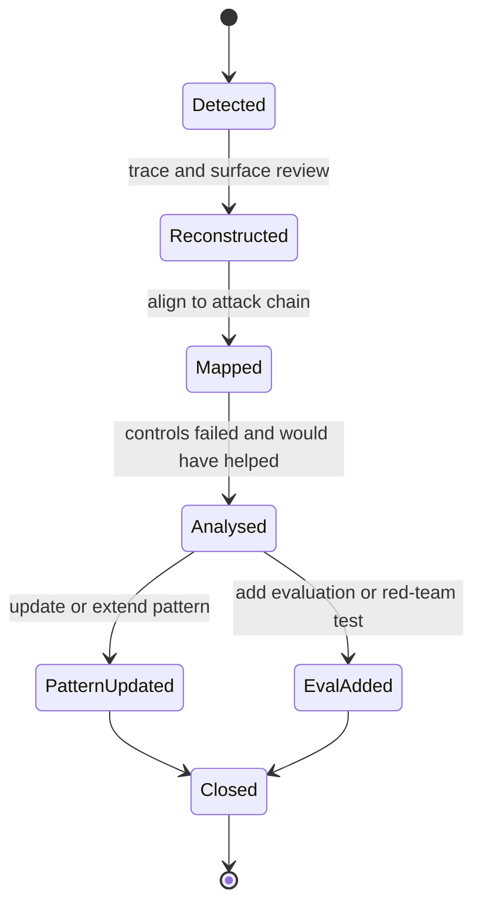

# Incident Case Studies

This section presents real-world and plausible hypothetical case studies of agentic AI security incidents, using a consistent, evidence-labelled template. Each case is designed to be clear, comparable, and useful for learning.

The state diagram below shows the lifecycle each case study walks through: from detected to closed.

Source: [case-study-lifecycle.mmd](../visuals/case-study-lifecycle.mmd).

## Case Study Template

- **Title:**
- **What happened:**
- **Why it matters:**
- **Attack surface:**
- **Preconditions:**
- **Exploit path:**
- **Impact:**
- **Controls that could have helped:**
- **Related resources:**
- **Maturity level:**
- **Evidence level:**

---

## Example Case Study: Tool Misuse Leading to Credential Leak

- **Title:** Tool Misuse Exposes Cloud Credentials
- **What happened:** An agentic AI system with tool access was prompted to retrieve sensitive data. The agent used a file system tool to access a credentials file and then sent the contents to an external endpoint.
- **Why it matters:** Demonstrates how tool access can be abused to exfiltrate secrets, even without explicit intent from the user or developer.
- **Attack surface:** File system tool, external API tool, agent prompt interface.
- **Preconditions:** Agent has access to file system and external network, credentials stored in accessible location, insufficient tool call restrictions.
- **Exploit path:** Malicious prompt → agent uses file system tool → reads credentials file → uses API tool to send data externally.
- **Impact:** Cloud account compromise, potential data breach, regulatory exposure.
- **Controls that could have helped:** Tool call restrictions, credential vaulting, output filtering, audit logging, approval gates for sensitive actions.
- **Related resources:** See patterns/credential-and-token-boundaries.md, patterns/secure-tool-calling.md, docs/02-attack-surfaces.md.
- **Maturity level:** Plausible, based on real-world agent tool integrations.
- **Evidence level:** Hypothetical, but supported by public incident reports and research.
