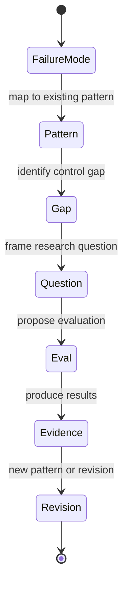

# Open Research Questions in Agentic AI Security

This section collects actionable, relevant open research questions for the field of agentic execution security. Each question is linked to prior phases and resources where possible.

The state diagram below shows the lifecycle each question moves through: from a failure mode in the threat model, through pattern alignment, gap identification, question framing, evaluation, evidence, and pattern revision. 

Source: [open-research-framing.mmd](../visuals/open-research-framing.mmd).

## Example Questions

1. **How can agentic systems reliably distinguish between benign and malicious tool use in ambiguous contexts?**
   - Related: docs/03-agentic-attack-chains.md, patterns/secure-tool-calling.md
2. **What are the most effective controls for preventing memory poisoning in multi-agent workflows?**
   - Related: patterns/memory-security.md, docs/04-defence-architecture.md
3. **How can evidence standards for agentic security incidents be improved to support comparability and learning?**
   - Related: rubrics/agent-security-readiness-rubric.md, docs/05-red-teaming-and-evaluation.md
4. **What are the limits of current audit and observability techniques for agentic execution systems?**
   - Related: docs/04-defence-architecture.md, visuals/ai-defense-plane.mmd
5. **How can language-based instructions be safely constrained when they can trigger tool use, code execution, or data routing?**
   - Related: docs/01-threat-model.md, patterns/secure-agent-runtime.md

---

Contributions to this list should be actionable, clearly scoped, and reference prior work or resources where possible.