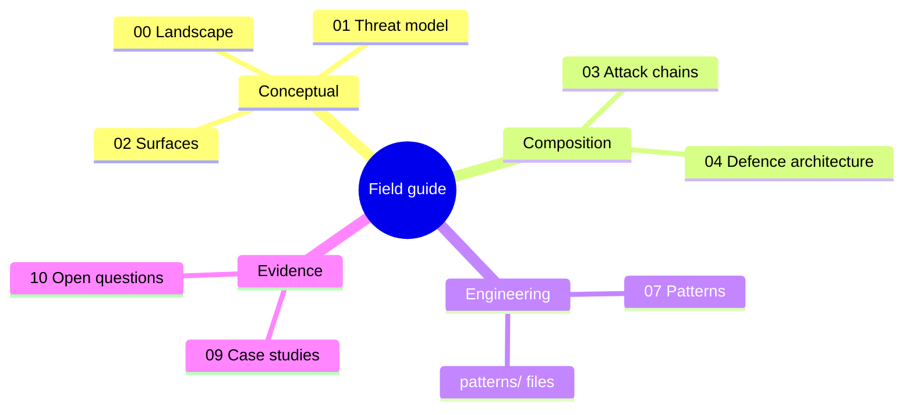

# Docs

This section is the conceptual map for agentic AI security. It will explain how risks emerge across the full execution system around a model: prompts, retrieved context, tools, credentials, memory, code execution, approvals, delegated authority, and multi-agent workflows.

The goal is to help readers understand failure modes and control boundaries before they move into resource lists, engineering patterns, diagrams, or assessment rubrics. Secure engineering patterns translate the threat model and defence architecture into reusable, diagrammed implementation controls that engineers can build to.

The mindmap below groups the documents in this section into four families: conceptual foundations, composition, engineering, and evidence. 

Source: [docs-reading-map.mmd](../visuals/docs-reading-map.mmd).

## Available Now

- [Landscape Map: Agentic Execution Security](00-landscape-map.md) explains the system-level security landscape around prompts, context, tools, credentials, memory, code execution, approvals, and downstream action.
- [Threat Model: Agentic AI Failure Modes](01-threat-model.md) defines the first threat taxonomy as failure modes, preconditions, impact, and control questions.
- [Attack Surfaces: Agentic Execution Systems](02-attack-surfaces.md) maps where language, context, authority, state, tools, memory, approvals, policies, and downstream systems expose risk.
- [Agentic Attack Chains: From Influence To Impact](03-agentic-attack-chains.md) shows how local weaknesses compose into breach paths and where defenders can interrupt them.
- [Agentic Attack Chain Library](agentic-attack-chains/README.md) provides a structured set of high-value attack chain stubs and a standard template for new chains.
- [Defence Architecture: Securing Agentic Execution](04-defence-architecture.md) defines the layered control model for observing, interpreting, constraining, auditing, discovering, protecting, and governing agentic systems.
- [Secure Engineering Patterns: From Defence Architecture To Code](07-secure-engineering-patterns.md) maps the threat model, attack surfaces, and chain interruptions to five reusable patterns (runtime, tool calling, MCP, memory, credentials), each with a boundary diagram, evaluation checks, and audit evidence requirements.

## Planned Coverage

Future docs will also cover:

- Red teaming and evaluation methods for agentic behaviour rather than single model responses.
- Case studies and open research questions.

## Reader Path

AI leaders and CTOs should use this section to understand why agentic systems change security architecture and assurance expectations. Start with [00 landscape map](00-landscape-map.md) and [04 defence architecture](04-defence-architecture.md), then read the context, risk, and limitations sections of [07 secure engineering patterns](07-secure-engineering-patterns.md).

AI engineers and security engineers should use it to map where controls need to sit across the execution environment. Read [01 threat model](01-threat-model.md), [02 attack surfaces](02-attack-surfaces.md), and [03 attack chains](03-agentic-attack-chains.md), then [07 secure engineering patterns](07-secure-engineering-patterns.md) and the individual files in [patterns/](../patterns/).

Governance leaders and researchers should use it to connect delegated authority, evidence, audit, evaluation, and open problems. The audit evidence sections in each pattern describe what the organisation should be able to retrieve for assurance, incident response, and accountability.

