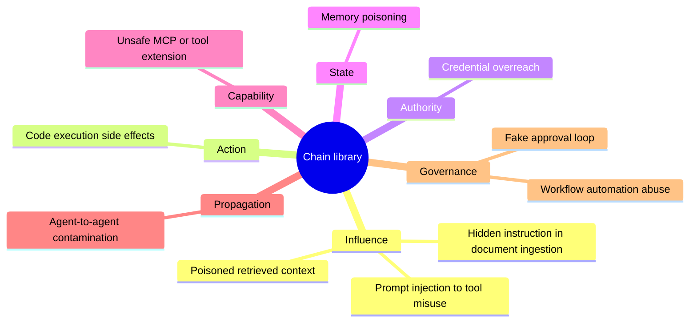

# Agentic Attack Chain Library

This section provides a structured library of high-value agentic attack chains, each using a standard template. The goal is to help readers understand how specific failure paths emerge in agentic AI systems and how they can be detected, controlled, and mitigated.

The mindmap below indexes the chains by the progressive-breach-model stage they represent. 

Source: [chain-library-index.mmd](../../visuals/chain-library-index.mmd).

## Available Attack Chain Stubs

- [Prompt Injection to Tool Misuse](prompt-injection-tool-misuse.md)
- [Poisoned Retrieved Context](poisoned-retrieved-context.md)
- [Memory Poisoning](memory-poisoning.md)
- [Unsafe MCP/Tool Extension](unsafe-mcp-tool-extension.md)
- [Credential Overreach](credential-overreach.md)
- [Fake Approval Loop](fake-approval-loop.md)
- [Agent-to-Agent Contamination](agent-to-agent-contamination.md)
- [Code-Execution Side Effects](code-execution-side-effects.md)
- [Hidden Instruction in Document Ingestion](hidden-instruction-document-ingestion.md)
- [Workflow Automation Abuse](workflow-automation-abuse.md)

See the [Attack Chain Template](attack-chain-template.md) for the standard structure to use when adding new chains.

---

**Related:**
- [Threat Model](../01-threat-model.md)
- [Attack Surfaces](../02-attack-surfaces.md)
- [Agentic Attack Chains Overview](../03-agentic-attack-chains.md)
- [Defence Architecture](../04-defence-architecture.md)
- [Secure Engineering Patterns](../../patterns/README.md)
