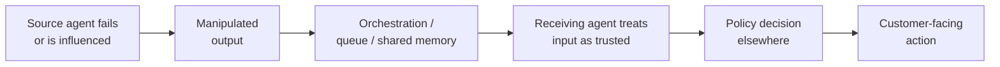
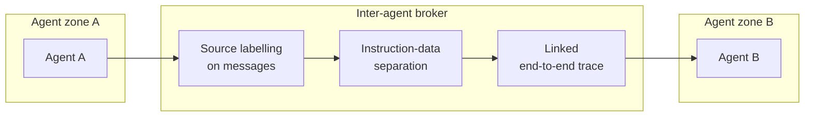

# Agent-to-Agent Contamination

Malicious data or instructions propagate from one agent to another, spreading compromise.

- See [attack-chain-template.md](attack-chain-template.md) for full structure.
- Related: [docs/01-threat-model.md](../01-threat-model.md), [docs/03-agentic-attack-chains.md](../03-agentic-attack-chains.md)

A failure or compromise in one agent emits manipulated output that flows through orchestration, queues, or shared memory into a second agent which treats it as trusted input, turning a contained local failure into a customer-facing policy decision elsewhere in the system.

  

Defence isolates each agent in its own zone, brokers every inter-agent message through a channel that source-labels content and preserves instruction-data separation, and stitches a single trace across boundaries so contamination cannot cross silently.

