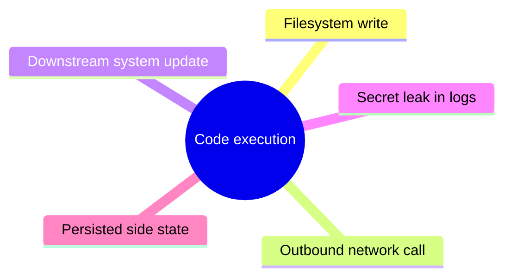
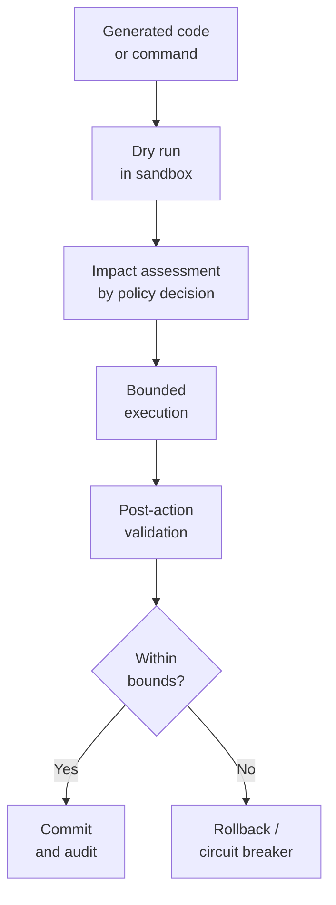

# Code-Execution Side Effects

Agent executes code with unintended or unsafe side effects, breaching system boundaries.

- See [attack-chain-template.md](attack-chain-template.md) for full structure.
- Related: [docs/01-threat-model.md](../01-threat-model.md), [patterns/secure-agent-runtime.md](../../patterns/secure-agent-runtime.md)

The agent runs generated code or commands whose visible result is the only thing surfaced to the user, while filesystem writes, outbound network calls, downstream updates, leaked secrets, and persisted state quietly accumulate as unaudited side effects.

  

Defence dry-runs every command in a sandbox, runs an impact assessment, executes within bounded authority, validates real outcomes against expectations, and rolls back or trips a circuit breaker the moment anything drifts beyond the approved blast radius.

