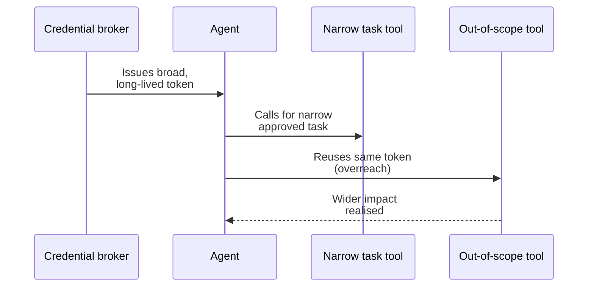
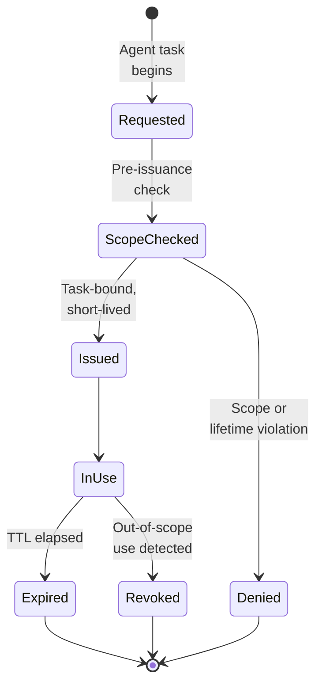

# Credential Overreach

Agent or tool is granted excessive credentials, enabling privilege escalation or data exfiltration.

- See [attack-chain-template.md](attack-chain-template.md) for full structure.
- Related: [docs/01-threat-model.md](../01-threat-model.md), [patterns/credential-and-token-boundaries.md](../../patterns/credential-and-token-boundaries.md)

The agent is issued a credential broader and longer-lived than its current task requires; after legitimately calling one tool it reuses the same token to invoke an unrelated, out-of-scope tool, expanding impact far beyond the user's intent.

  

Defence brokers credentials per task, checks scope and lifetime before issuance, hands out short-lived task-bound tokens from a vault, and revokes them automatically on expiry or out-of-scope use so that no credential outlives the action it was approved for.

