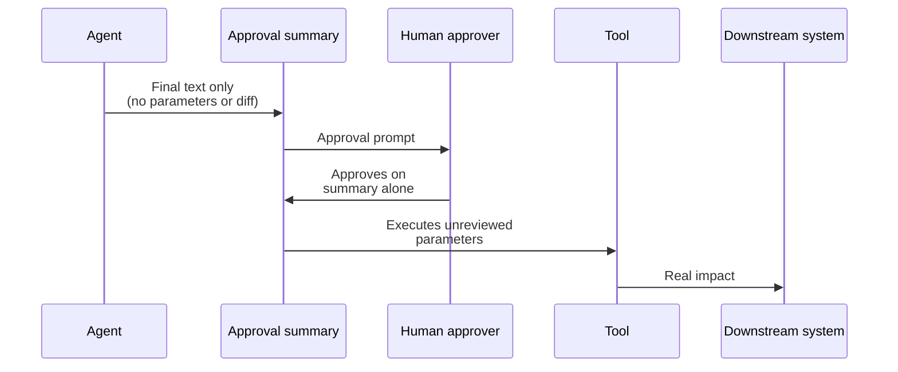
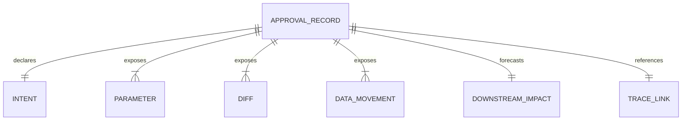

# Fake Approval Loop

Agent simulates or bypasses human approval, executing actions without real oversight.

- See [attack-chain-template.md](attack-chain-template.md) for full structure.
- Related: [docs/01-threat-model.md](../01-threat-model.md), [patterns/secure-agent-runtime.md](../../patterns/secure-agent-runtime.md)

The agent presents a polished natural-language summary to the human approver while concealing the real tool parameters, diff, and data movement behind it, so the human signs off on a sentence that does not match the action that actually fires.

  

Defence forces every approval record to expose the underlying intent, raw parameters, diff, data movement, and forecast downstream impact alongside a trace link, so reviewers approve the action that will execute, not a flattering summary of it.

