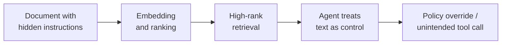
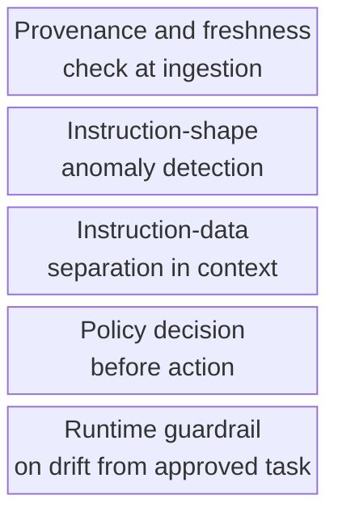

# Hidden Instruction in Document Ingestion

Instructions are hidden in ingested documents, causing the agent to act unexpectedly.

- See [attack-chain-template.md](attack-chain-template.md) for full structure.
- Related: [docs/01-threat-model.md](../01-threat-model.md), [patterns/secure-agent-runtime.md](../../patterns/secure-agent-runtime.md)

An attacker conceals directives inside a document — in metadata, comments, or invisible text — so when retrieval ranks it highly the agent ingests it and treats the embedded instructions as control rather than evidence, overriding policy or invoking tools the user never asked for.

  

Defence checks provenance and freshness at ingestion, scans for instruction-shaped content, enforces instruction-data separation in the agent's context, and runs every action through a policy decision and runtime guardrail so embedded directives cannot quietly become commands.

