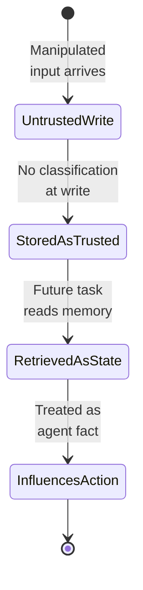
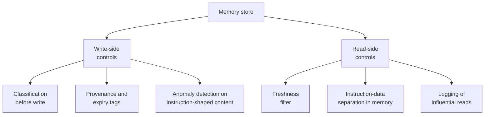

# Memory Poisoning

Malicious input corrupts agent memory, leading to unsafe or unintended actions.

- See [attack-chain-template.md](attack-chain-template.md) for full structure.
- Related: [docs/01-threat-model.md](../01-threat-model.md), [patterns/memory-security.md](../../patterns/memory-security.md)

An attacker manipulates input during one session so a poisoned fact is committed to long-term memory; in a later, unrelated session the agent retrieves it as trusted state and lets it shape decisions the attacker is no longer present to make.

  

Defence classifies and tags every write with provenance and expiry, blocks instruction-shaped content from entering memory, and re-checks freshness and trust on every read so that no untrusted fact silently becomes durable agent state.

