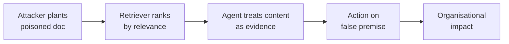
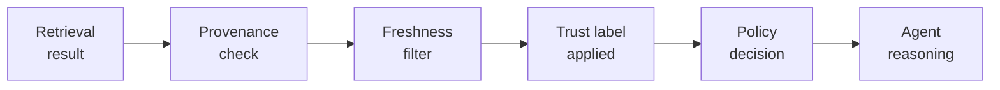

# Poisoned Retrieved Context

Retrieved context is manipulated to influence agent behaviour or outputs.

- See [attack-chain-template.md](attack-chain-template.md) for full structure.
- Related: [docs/01-threat-model.md](../01-threat-model.md), [patterns/memory-security.md](../../patterns/memory-security.md)

An attacker plants a document the retriever will rank highly so that when the agent fetches context for an unrelated task it pulls in attacker-controlled content and treats it as authoritative evidence for a high-impact decision.

  

Defence checks every retrieval result for provenance and freshness, attaches an explicit trust label, and routes it through a policy decision so that low-trust or stale content cannot silently shape the agent's reasoning.

