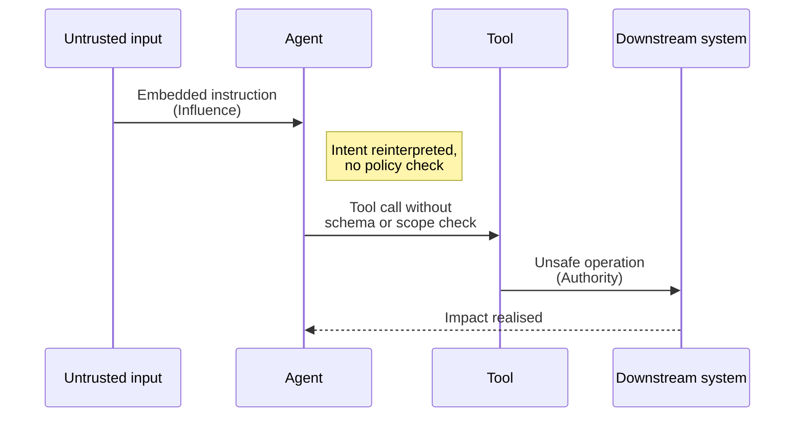
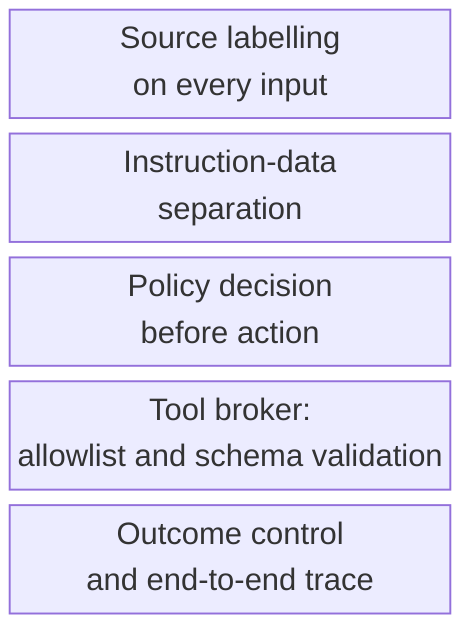

# Prompt Injection to Tool Misuse

A malicious prompt causes the agent to misuse a tool, breaching intended boundaries.

- See [attack-chain-template.md](attack-chain-template.md) for full structure.
- Related: [docs/01-threat-model.md](../01-threat-model.md), [docs/02-attack-surfaces.md](../02-attack-surfaces.md), [patterns/secure-tool-calling.md](../../patterns/secure-tool-calling.md)

An attacker hides directives inside ordinary user input so the agent treats them as legitimate goals, calls a tool with attacker-chosen parameters, and reaches the downstream system before any policy check has a chance to fire.

  

Defence source-labels every input, separates instructions from data, forces a policy decision before any tool is invoked, and routes the call through a tool broker so that even a successful injection cannot reach the downstream system unchecked.

