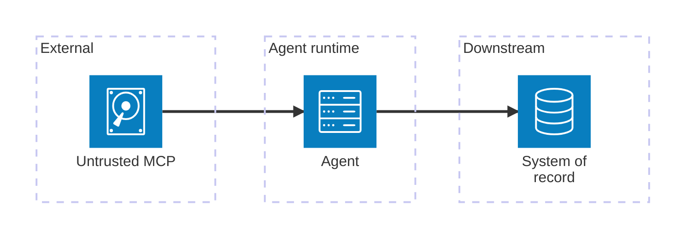
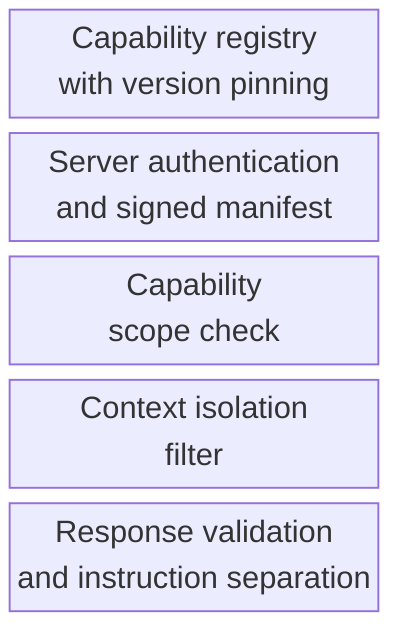

# Unsafe MCP/Tool Extension

An untrusted or unsafe extension to the MCP or tool interface enables new attack paths.

- See [attack-chain-template.md](attack-chain-template.md) for full structure.
- Related: [docs/01-threat-model.md](../01-threat-model.md), [patterns/secure-mcp.md](../../patterns/secure-mcp.md)

A capability is added to the agent's MCP surface without registry review, signing, or scope check, giving an untrusted server a direct path from agent intent to high-impact downstream actions on real systems of record.

  

Defence pins every capability in a versioned registry, requires a signed manifest, checks scope before each call, isolates the capability's context, and validates its responses so that an untrusted or compromised server cannot smuggle authority into the agent.

