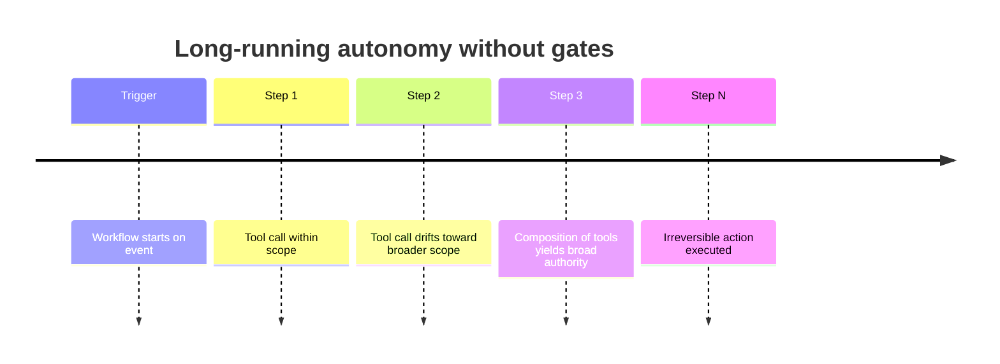
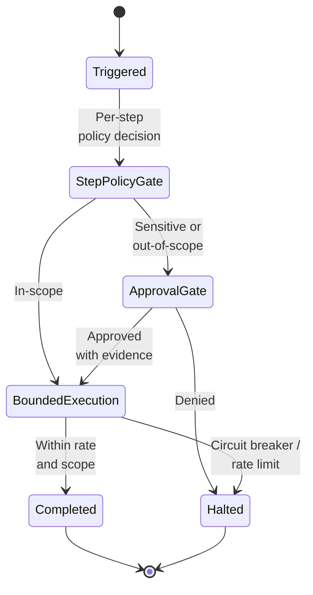

# Workflow Automation Abuse

Agentic workflow automation is abused to escalate privileges or bypass controls.

- See [attack-chain-template.md](attack-chain-template.md) for full structure.
- Related: [docs/01-threat-model.md](../01-threat-model.md), [patterns/secure-agent-runtime.md](../../patterns/secure-agent-runtime.md)

A long-running workflow with broad tool access and weak stopping conditions drifts step by step from its approved scope, composing many small in-policy tool calls into broad effective authority that culminates in an irreversible action no single step would have been allowed to take.

  

Defence places a policy gate at every step, escalates sensitive or out-of-scope actions to an evidence-rich approval, executes within rate limits and circuit breakers, and halts the entire workflow as soon as drift, denial, or limit-breach is detected.

