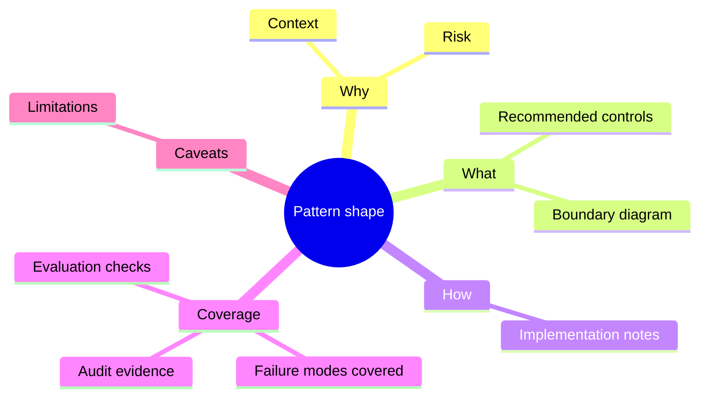

# Patterns

This section holds secure engineering patterns for agentic systems. The focus is practical: how to design controls around the full system of action rather than relying only on model-level filtering.

Patterns connect a system context to a risk, a recommended control, implementation considerations, validation checks, and known limitations. Each pattern follows the standard shape below.

Source: [pattern-shape.mmd](../visuals/pattern-shape.mmd).

## Planned Coverage

Future patterns will cover:

- Secure agent runtime boundaries.
- Secure tool calling and tool brokering.
- MCP and skill governance.
- Memory and context security.
- Credential and token boundaries.
- Human approval gates and hand-off controls.
- Sandboxing and code execution boundaries.
- Observability, audit, and policy enforcement.
- Outcome control for autonomous or semi-autonomous action.

## Pattern Shape

Each pattern should explain:

- Context: where the pattern applies.
- Risk: what failure mode it addresses.
- Control: what should constrain or govern the behaviour.
- Implementation notes: how teams can apply it without assuming one vendor or stack.
- Evaluation checks: how to know the control is working.
- Limitations: where the pattern is insufficient or needs additional controls.

## Design Principle

Agentic systems should be treated as execution environments. Useful patterns should therefore reason across prompts, context, tools, memory, credentials, code execution, approvals, delegated authority, and downstream outcomes.