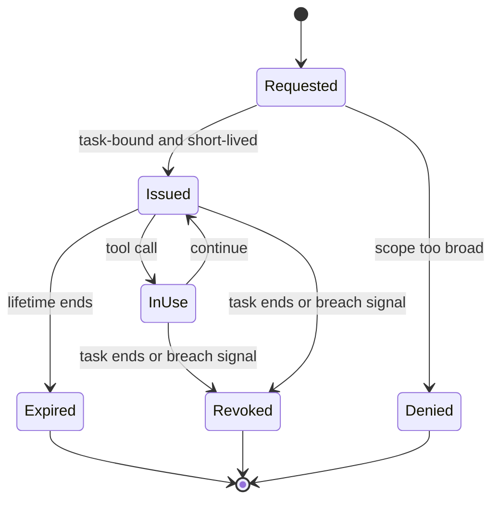

# Credential and Token Boundaries

## Context

Credentials and tokens determine what an agentic action can affect. They turn a proposed step into an authorised change in real systems. In agentic systems, authority is rarely a single user session — it can come from a user identity, a service identity, a delegated scope, an API key, a workflow runner, a cloud role, or an approval system.

This pattern applies wherever an agent host can:

- Reach a secret store or identity provider.
- Acquire credentials for tool calls, MCP servers, downstream APIs, code execution, or workflow steps.
- Hold credentials in process memory, prompts, retrieved context, tool output, logs, or persistent memory.
- Pass credentials to capabilities that execute on the agent's behalf.

The pattern sits next to the secure tool calling pattern and the MCP pattern: those patterns decide that an action should happen and which capability runs it; this pattern decides which authority is used and how it is bound to the task.

## Risk

Credential boundaries concentrate several failure modes from [docs/01-threat-model.md](../docs/01-threat-model.md):

- **Authority over-grant.** The agent acts under a long-lived, broadly scoped credential. A narrow request can change repositories, cloud resources, SaaS records, communications, or financial state outside the intended scope.
- **Identity confusion.** Service or admin identities are reused across tasks and users. Audit records cannot distinguish whose action it was.
- **Credential leakage.** Tokens reach prompts, retrieved context, tool output, model-visible context, memory, or logs. They are then re-exposed across tasks, traces, or sessions.
- **Stale or shared tokens.** Reused tokens enable lateral movement between agents, tasks, or environments after a single compromise.
- **Implicit elevation.** A capability that requires elevated scope is invoked under a token that already has it, even though the task did not need it.
- **Slow revocation.** A compromised credential continues to work because revocation is manual, partial, or delayed across systems.
- **Approval-credential mismatch.** A human approves a narrow action; the credential issued for execution is broader.

## Recommended Controls

Authority should be brokered, scoped, time-limited, task-bound, and observable.

1. **Credential broker.** All credentials used by the agent and its capabilities are issued by a broker that knows the user, task, capability, and approved scope. The agent does not hold long-lived credentials.
2. **Task-bound issuance.** Each credential is bound to a task identifier, a capability identifier, and the approved action. Out-of-task or out-of-capability use is denied.
3. **Least-privilege scope.** The broker selects the narrowest scope that completes the operation. A read does not get write scope; a single record update does not get bulk scope.
4. **Short lifetime.** Credentials expire on completion of the call, end of the task, or a small time window — whichever is shortest.
5. **Pre-issuance scope and lifetime check.** A policy check confirms the scope and lifetime are within the approved boundary before issuance.
6. **Vault-backed secrets.** Long-lived secrets (root credentials, refresh tokens) live in a vault. The broker uses them to mint short-lived tokens; agents and capabilities never receive the long-lived material.
7. **Secret filter on outputs and logs.** Tool output, prompts, model-visible context, memory candidates, and logs pass through a filter that detects and redacts secret-shaped content before further use.
8. **Revocation paths.** Each credential type has a documented and exercised revocation path. Emergency revocation should propagate within minutes across the broker, the issuing system, and any caches.
9. **Approval-credential alignment.** When a human approves an action, the credential issued must match the approved scope. The broker should not issue broader scope than the approval covers.
10. **Identity in audit.** Effective identity, scope, lifetime, task binding, capability, and approval reference appear in every audit record for an action.

## Boundary Diagram

The flow diagram traces a credential from user identity and approved task, through the broker, the scope and lifetime check, the vault-backed secret source, and the policy check, to a scoped short-lived token used by a single tool, MCP server, or workflow. The expiry and revocation events feed back to the broker, and the secret filter sits on the output path.

Source: [credential-token-boundaries.mmd](../visuals/credential-token-boundaries.mmd).The picture clarifies that every token has an explicit end-of-life event.

## Implementation Notes

- **Centralise issuance.** A single broker (or a small set of brokers per environment) is easier to monitor and audit than per-tool credential handling. Make it the default path; treat anything else as an exception.
- **Bind to the task identifier early.** Issue credentials only after the task has a pinned scope, an approved capability list, and a trace identifier. Tokens that float free of a task are harder to revoke and audit.
- **Prefer short lifetimes over wide scopes.** A token that lives for one call is easier to reason about than a token that lives for an hour. Combine with rate limits at the tool broker.
- **Use a vault for long-lived secrets and never expose them to agent context.** Root credentials, OAuth refresh tokens, and signing keys must not appear in prompts, retrieved content, memory, or model-visible state.
- **Filter outputs before they re-enter reasoning.** Tool output, MCP server responses, and downstream messages should pass through a secret filter. The filter should redact and log, not silently drop.
- **Filter logs and traces too.** Audit usefulness depends on logs being safe to read. The same secret filter should sit on the logging path.
- **Map every approval to a credential decision.** When a human approves an action, record the scope they approved. The broker should refuse to issue beyond it.
- **Test revocation regularly.** A revocation path that has never been exercised will fail under pressure. Run synthetic revocation drills as part of routine work, not only after incidents.
- **Plan for capability-level identity.** Where possible, each capability uses a credential issued for that capability and task. A single shared identity across capabilities undoes the benefit of brokering.
- **Watch for exfiltration patterns.** A burst of read tokens followed by an outbound send is a known unsafe composition. The tool broker (see [secure-tool-calling.md](secure-tool-calling.md)) should detect; the credential broker should be the place to enforce expiry and revocation.

## Failure Modes Covered

Direct coverage from the [threat model](../docs/01-threat-model.md):

- **Credential and token misuse** — primary coverage; this pattern exists for it.
- **Tool misuse via authority over-grant** — least-privilege scope, task-binding, and short lifetimes reduce blast radius when a tool is misused.
- **MCP, skill, and extension compromise blast radius** — per-capability identity contains a compromised capability to its scope.
- **Multi-agent propagation via shared identity** — task-bound credentials prevent one agent's compromise from acting through another's authority.
- **Unsafe autonomous action with broad authority** — short lifetimes and approval-credential alignment keep autonomy bounded.

Partial coverage:

- **Prompt and instruction attacks reaching authority** — secret filters on outputs and logs prevent leakage; instruction-data separation lives in the runtime pattern.
- **Memory poisoning that includes secrets** — classification refuses secrets in memory; this pattern removes the need for the agent to remember secrets in the first place.

## Evaluation Checks

- Does the agent hold any long-lived credential outside the broker? A red-team review of the agent host process and configuration should find none.
- For each capability, is there a defined credential type, scope, lifetime, and issuance path? Capabilities without one should not be in the registry.
- For ten randomly selected actions, can a reviewer recover the trace identifier, identity used, scope, lifetime, task binding, capability, and approval reference?
- When a synthetic test asks the agent to act outside its task scope, does the broker refuse to issue a credential and log the attempt?
- When an approval narrows the action below the requested scope, does the broker issue a credential matching the approval, not the request?
- Does the secret filter detect and redact synthetic secret-shaped content in tool output, prompts, memory candidates, and logs?
- Does emergency revocation propagate within the documented target across the broker, issuing system, and caches?
- Are revocation drills exercised on a recurring basis? Is the most recent drill date visible to operators?

## Audit Evidence

For each action that used a credential, a reviewer should be able to retrieve under the task's trace identifier:

- The user or workflow identity that owns the task and the approved task scope.
- The broker decision (allow, deny, narrow), the matched policy, the scope and lifetime issued, and the capability target.
- The credential type, issuance time, expiry, and binding (task, capability, approval reference) — without the secret value.
- The vault source of the long-lived secret used to mint the short-lived token, where applicable.
- The capability or tool runtime that received the credential and the action it took.
- The secret-filter result on outputs and logs (passed clean, redacted, blocked).
- The revocation event, if any (cause, target, propagation result).
- The approval record, where required, including the approver identity, evidence shown, and approved scope.

Audit records should be queryable by identity, by task, by capability, by approval reference, and by scope.

## Limitations

- A credential broker depends on a healthy identity and secret-management infrastructure. Without that foundation, the broker becomes a single point of failure or a bottleneck.
- Per-call short lifetimes increase issuance volume and can create operational noise. Rate, batch, and cache decisions should be tuned to keep audit clean without overwhelming the broker.
- Secret filters miss novel formats and can produce false positives. Combine deterministic patterns with a periodic review of redaction rates and incidents.
- Approval-credential alignment requires that approval prompts capture scope, not only intent. Approval interfaces that show only a free-text summary make this hard.
- Some legacy systems do not support short-lived scoped tokens. For those, compensate with stricter tool broker policy, tighter approvals, and shorter task horizons.
- Capability-level identity adds operational work. Teams should plan for identity provisioning, lifecycle, and incident response per capability.
- A broker cannot prevent misuse of an issued, in-scope token within its valid window. Outcome control, rate limits, and per-capability rate limits are the compensating controls in that window.

## Related

- [docs/01-threat-model.md](../docs/01-threat-model.md) — failure mode 4 (credential and token misuse).
- [docs/02-attack-surfaces.md](../docs/02-attack-surfaces.md) — Credential and Authority Surfaces.
- [docs/03-agentic-attack-chains.md](../docs/03-agentic-attack-chains.md) — Chain Pattern 4 (broad authority to downstream change).
- [docs/04-defence-architecture.md](../docs/04-defence-architecture.md) — Identity and access, credential broker, and human approval layers.
- Sibling patterns: [secure-agent-runtime.md](secure-agent-runtime.md), [secure-tool-calling.md](secure-tool-calling.md), [secure-mcp.md](secure-mcp.md), [memory-security.md](memory-security.md).

Maturity: stable defensive guidance. Last reviewed: 2026-04-29.
