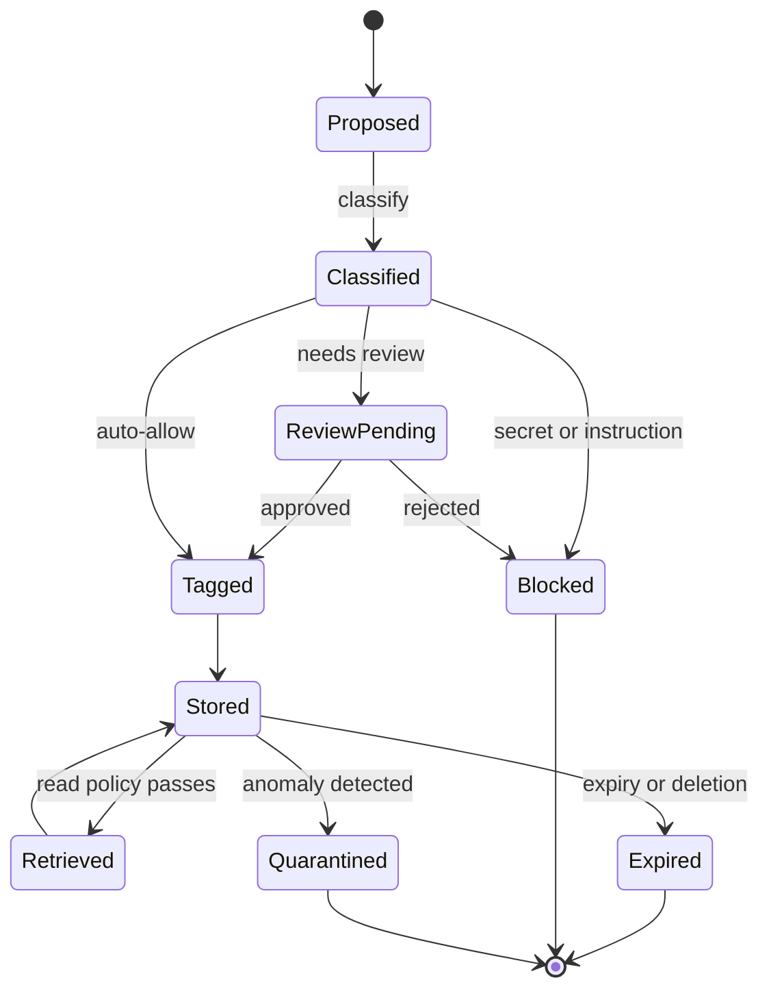

# Memory Security

## Context

Agentic systems use memory to carry context, intermediate results, learned preferences, summaries, and task state across steps and sessions. Memory makes agents useful over time, and it is also where a transient compromise can become persistent.

This pattern applies wherever an agent host can:

- Write to a memory store from agent reasoning, tool output, retrieved content, or another agent's output.
- Retrieve memory entries into a future reasoning step, approval prompt, or tool call.
- Share memory across tasks, sessions, users, or agents.
- Summarise prior context and store the summary as new memory.

Memory sits next to the runtime, the tool calling pattern, and the MCP pattern — most memory writes are triggered by something one of those patterns produced. Memory is a separate pattern because the failure mode (persistence and reuse) differs from a single-step risk.

## Risk

Memory concentrates several failure modes from [docs/01-threat-model.md](../docs/01-threat-model.md):

- **Memory poisoning.** Manipulated facts, preferences, or instruction-shaped content are written to memory and influence later sessions, approvals, or tool calls. The original influence may be untraceable by the time it acts.
- **Secret persistence.** Tool output, prompts, or retrieved content carrying tokens, keys, or sensitive identifiers are written to memory and re-exposed across tasks.
- **Provenance loss.** A summary of summaries strips source, freshness, and trust labels. The agent later treats stripped memory as authoritative.
- **Cross-task and cross-user leakage.** Memory written for one user, task, or scope is retrieved into another, breaking isolation.
- **Stale memory.** Facts true at the time of the write become misleading later, but no expiry or freshness check forces revision.
- **Unbounded growth.** Memory grows without retention rules, making review, governance, and incident response slower and less complete.
- **Untrusted instruction in memory.** Memory entries that read like instructions (role redefinitions, allowlist overrides) can be retrieved and silently expand the agent's authority.

## Recommended Controls

Memory should be treated as security-relevant state, with explicit controls on writes, reads, lifecycle, and content classes.

1. **Classification before write.** Every memory candidate is classified into an allowed category. Categories such as user preference, task state, factual summary, and operational note are permitted; secrets, untrusted instructions, and policy overrides must never be stored.
2. **Write policy decision.** A policy stage approves, denies, or requires review for each candidate. The policy sees source, classification, sensitivity, and the task scope.
3. **Provenance, owner, scope, and expiry tags.** Every memory entry carries source, owner, task or session scope, write reason, and an expiry. Entries without these tags are not retrievable.
4. **Read policy decision.** Reads pass a policy check that uses task scope, identity, and entry tags. Out-of-scope reads are denied or redacted.
5. **Provenance and freshness filter at read.** Retrieved entries are filtered, source-labelled, and presented as quoted evidence rather than as authoritative truth.
6. **Instruction-data separation in memory.** Memory content that re-enters the reasoning step is treated as data. The runtime should refuse to let memory redefine goals, allowlists, or policy.
7. **Reviewer-visible memory.** Users and reviewers can list, inspect, correct, expire, and delete memory entries that affect them.
8. **Anomaly detection.** Sudden changes in memory volume, content distribution, or retrieval patterns trigger alert and quarantine. Specific drift signals (instruction-shaped content, suspected secrets) should be flagged on write and on read.
9. **Retention and deletion rules.** Default expiry by category. Hard caps on volume per scope. Deletion paths that are exercised, not only documented.
10. **Logging of writes and influential reads.** Every write is logged. Reads that influence a tool call, approval, or downstream action are linked to the action under the same trace identifier.

## Boundary Diagram

The flow diagram shows the write path (source, classification, policy check, optional review, provenance tagging, store) and the read path (request, policy check, provenance and freshness filter, injection into context). It also makes the anomaly-detection and audit edges explicit.

Source: [memory-security-flow.mmd](../visuals/memory-security-flow.mmd). The state model makes the lifecycle explicit and shows that memory is not a passive store — every entry passes a write policy on the way in and a read policy on the way out.

## Implementation Notes

- **Pin a memory namespace per task and per scope.** Tasks should write into and read from explicit namespaces, not a global store. Cross-namespace reads should be a deliberate, policy-gated operation.
- **Classify on the way in.** Use deterministic rules first (regexes for secrets, known instruction templates for prompt-injection patterns) and a model-based classifier as a backstop, not the other way round. Deterministic rules are easier to audit.
- **Refuse the unclassifiable.** If the system cannot classify a candidate confidently, the default is do not store. A small loss of recall is preferable to writing untrusted content.
- **Tag everything.** Source, owner, scope, expiry, write reason, classifier confidence, and the trace identifier of the originating step. Untagged entries should not survive a periodic sweep.
- **Treat summaries as new entries.** A summary inherits the lowest trust level among its sources, not the highest. Summaries do not erase provenance debt.
- **Keep secrets out of memory by construction.** The credential broker (see [credential-and-token-boundaries.md](credential-and-token-boundaries.md)) should issue credentials per call, so there is no need for the agent to remember them. If the agent appears to need to remember a secret, redesign the tool flow.
- **Make deletion real.** Soft-delete with no purge schedule does not satisfy reviewer-visible memory. Document the deletion path, exercise it on a recurring basis, and verify it.
- **Log influential reads.** A retrieval that did not change behaviour can be sampled. A retrieval that fed a tool call, approval, or downstream action should be linked to that action's trace.
- **Test memory under adversarial input.** Plant instruction-shaped content via retrieval or tool output and confirm the write policy refuses it; plant a secret-shaped string and confirm classification blocks it.

## Failure Modes Covered

Direct coverage from the [threat model](../docs/01-threat-model.md):

- **Memory poisoning** — primary coverage; this pattern exists for it.
- **Credential and token misuse via memory** — classification refuses secrets and the credential broker pattern removes the need to store them.
- **Context poisoning via memory recall** — provenance and freshness filter, plus instruction-data separation, reduce the chance that poisoned memory drives action.
- **Monitoring and evaluation blind spots in memory** — write logs, influential read logs, and anomaly detection make memory observable.

Partial coverage:

- **Prompt and instruction attacks** — memory blocks instruction-shaped content from persisting; runtime patterns address single-step instruction handling.
- **Multi-agent propagation** — namespace isolation reduces cross-agent leakage; broader inter-agent trust controls remain a planned pattern.

## Evaluation Checks

- Is every memory entry tagged with source, owner, scope, expiry, write reason, classification, and trace identifier? Are untagged entries refused or removed by a recurring sweep?
- When a synthetic write contains an instruction-shaped string, does the write policy refuse and log the attempt?
- When a synthetic write contains a secret-shaped string (token, key, identifier), does classification block it?
- For ten randomly selected memory reads that influenced a tool call, approval, or downstream action, can a reviewer trace the read to the action under the same trace identifier?
- When an out-of-scope read is requested across namespaces, does the read policy deny and log the attempt?
- Does the deletion path actually remove the entry from primary storage, replicas, and any derived summaries within a documented target?
- Do anomaly detectors trigger on synthetic burst, drift, and content-distribution tests?

## Audit Evidence

For each memory event, a reviewer should be able to retrieve under the relevant trace identifier:

- For writes: source, candidate content (or hash where content is sensitive), classification, write policy decision, reviewer approval where required, tags, and store location.
- For reads: requester, scope, read policy decision, entries returned, filter and source-label transformations, and the action they fed (tool call, approval, downstream change).
- For deletions: requester, reason, scope of deletion, verification, and confirmation that derived summaries were also addressed.
- For anomaly events: detector identity, signal, scope quarantined, follow-up review, and resolution.

Audit records should be queryable by namespace, by owner, by classification, by trace identifier, and by anomaly signal.

## Limitations

- Classification is imperfect. Deterministic rules miss novel patterns; classifiers produce false positives. The pattern is robust under both because the default is do not store, but teams should expect tuning work.
- A memory store cannot fix problems upstream. If retrieval already merged untrusted content into reasoning, the memory pattern can only prevent persistence — it cannot undo the in-flight effect.
- Reviewer-visible memory is only as useful as the review interface. A list of opaque entries does not help users correct or expire memory. Investment in tooling is part of the pattern.
- Hard expiry can lose useful long-running context. The retention rules should be tuned per category, with longer expiry for low-risk categories and aggressive expiry for high-risk ones.
- Memory shared across tasks or users requires explicit cross-namespace policy. The default of strict isolation is safer; relaxations should be reviewed.
- Anomaly detection produces false positives. The escalation should be quarantine and review, not silent drop, so that legitimate patterns can be restored.

## Related

- [docs/01-threat-model.md](../docs/01-threat-model.md) — failure mode 6 (memory poisoning) and failure mode 5 (context poisoning).
- [docs/02-attack-surfaces.md](../docs/02-attack-surfaces.md) — Memory and State Surfaces.
- [docs/03-agentic-attack-chains.md](../docs/03-agentic-attack-chains.md) — Chain Pattern 3 (tool result to memory persistence).
- [docs/04-defence-architecture.md](../docs/04-defence-architecture.md) — Memory and context layer.
- Sibling patterns: [secure-agent-runtime.md](secure-agent-runtime.md), [secure-tool-calling.md](secure-tool-calling.md), [credential-and-token-boundaries.md](credential-and-token-boundaries.md), [secure-mcp.md](secure-mcp.md).

Maturity: stable defensive guidance. Last reviewed: 2026-04-29.
