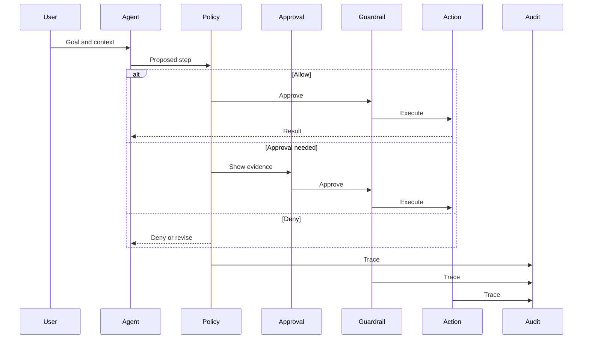
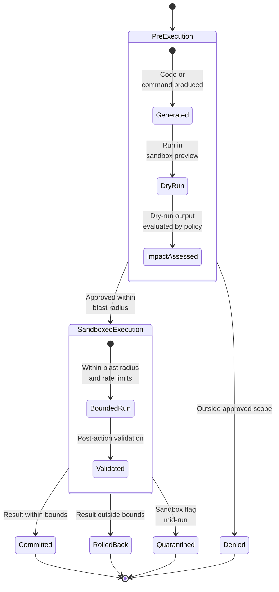

# Secure Agent Runtime

## Context

The secure agent runtime is the environment in which an agent interprets a goal, draws on context and memory, proposes plans, calls tools, and produces results. It is the surface where language-shaped intent becomes system action.

This pattern applies wherever an agent can:

- Take an open-ended goal and decompose it into steps.
- Mix instructions and content from different trust levels (system, user, retrieved, tool result, memory, other agents).
- Call tools, MCP servers, skills, or workflows that affect real systems.
- Read or write memory that influences future sessions.
- Act with multi-step autonomy, with or without approval gates.

The runtime is the central place where the four runtime security capabilities described in [docs/04-defence-architecture.md](../docs/04-defence-architecture.md) — observe, interpret, constrain, audit — must be glued together. Other patterns (tool calling, MCP, memory, credentials) sit inside or alongside this pattern.

## Risk

The runtime is exposed to several composing failure modes:

- **Untrusted instruction can become control.** Retrieved documents, tool results, prior memory, or messages from other agents can carry instructions the user did not approve. If the runtime treats them as control input, the agent can act on goals it was never given.
- **Unbounded autonomy.** Without explicit stopping conditions, an agent can chain steps until it produces high-impact effects that no single step would have justified.
- **Late control.** If observation, interpretation, and constraint happen only after a final answer, controls arrive too late to prevent unsafe tool calls, memory writes, or downstream effects.
- **Missing audit chain.** Without a linked trace from instruction to outcome, the organisation cannot reconstruct what happened, prove what changed, or distinguish a good outcome from a lucky one.
- **Static configuration.** Runtimes that cannot reload policy, allowlists, or tool catalogues without redeployment leave a window where known-bad behaviour continues.

The runtime is also the layer where most other patterns can be silently bypassed: a tool broker that is not consulted, a credential broker that is skipped, or a memory write that is not classified all happen because the runtime did not enforce them.

## Recommended Controls

The runtime should provide explicit, named slots for each control rather than leaving them implicit.

1. **Capability constraints by task.** Bind the agent to an allowlist of tools, MCP servers, memory scopes, and downstream systems for the current task, not for the agent identity in general.
2. **Source labelling on every input.** System prompts, user prompts, retrieved content, tool results, memory, and inter-agent messages should be tagged with origin and trust level before they enter the reasoning step.
3. **Instruction-data separation.** Untrusted content should be passed as quoted evidence, not merged into the instruction layer.
4. **Policy decision before action.** Every proposed tool call, memory write, or downstream action should pass through a policy decision that sees intent, source, identity, and likely impact together.
5. **Runtime guardrails during execution.** Mid-step checks should compare the current step against the approved task and stop or revise drift.
6. **Approval gates for sensitive, irreversible, or out-of-scope actions.** Approvals should show source context, parameters, identity, and expected effect — not only a confident final summary.
7. **Outcome control after action.** Dry runs, previews, post-action validation, rate limits, and rollback paths should sit between the tool runtime and downstream impact.
8. **End-to-end trace.** Prompt, context, plan, decision, credential, tool call, memory change, approval, and downstream action should be linked under a single trace identifier.
9. **Hot-reloadable policy.** Allowlists, deny rules, approval thresholds, and capability catalogues should be updatable without redeploying the agent.

## Boundary Diagram

The runtime boundary diagram shows where each control sits between the agent's reasoning step and the action execution surface, and how every step also feeds the audit channel.

Source: [secure-agent-runtime-boundaries.mmd](../visuals/secure-agent-runtime-boundaries.mmd). A sequence diagram is used because the runtime is a series of step-by-step interactions between named participants (agent, policy, approval, guardrail, action, audit) — the order matters and a flowchart hides it. The diagram makes three things explicit: every step passes through a policy decision before reaching execution, every decision emits an audit trace, and every path has a deny or approval branch in addition to allow.

For the broader system-level reference model, see [visuals/secure-agent-reference-architecture.mmd](../visuals/secure-agent-reference-architecture.mmd).

## Sandboxed Execution Lifecycle

The boundary diagram above shows when controls fire. The state diagram below shows the lifecycle of a single piece of generated code or command as it crosses three execution phases: pre-execution checks, sandboxed bounded run, and post-execution disposition. A state diagram with composite states is used because the phases are nested — each phase has its own internal transitions — and because every terminal state (committed, rolled back, quarantined, denied) must be loggable on its own.

Source: [sandboxed-code-execution.mmd](../visuals/sandboxed-code-execution.mmd). The diagram makes the outcome-control vocabulary explicit: dry runs and impact assessment happen before any real effect, blast-radius and rate-limit bounds wrap the run itself, and the post-execution state — committed, rolled back, quarantined, or denied — is always one of four logged outcomes, never an implicit success.

## Implementation Notes

These notes are vendor-agnostic. They describe the shape of the controls, not a specific framework.

- **Build the runtime as a pipeline of named stages.** Intake, classification, planning, policy, guardrail, tool broker, credential broker, action, outcome, audit. Each stage should have a clear input, output, decision record, and audit hook. Avoid runtimes where the agent reasoning step calls tools directly without passing through a broker.
- **Treat the agent reasoning step as untrusted.** The agent can be influenced by retrieved content, so policy and guardrail stages should not rely on the agent's self-report. They should evaluate the proposed step independently.
- **Pin a task scope at intake.** When a task starts, freeze the allowed tools, data scopes, identity, memory namespaces, and downstream systems. The runtime should refuse silent expansion.
- **Use a single trace identifier per task** and propagate it through every stage, every tool call, every memory write, and every downstream record. This is what makes incident reconstruction possible.
- **Separate the policy engine from the agent.** A runtime that asks the agent to evaluate its own policy compliance does not have a policy decision; it has a self-report. Policy decisions should run in code with access to the proposed step, identity, scope, and risk context.
- **Default deny for unknown tools, capabilities, scopes, and downstream systems.** New capabilities should be added through review, not discovered at runtime.
- **Make stop conditions explicit.** Maximum steps, maximum cost, maximum data movement, maximum elapsed time, and maximum approval prompts. Reaching a stop condition should always be a logged event.
- **Persist the plan, not only the final answer.** The proposed step list, revisions, and abandoned branches are part of the audit chain.

## Failure Modes Covered

This pattern is the default integration surface for most failure modes in [docs/01-threat-model.md](../docs/01-threat-model.md). Direct coverage:

- **Prompt and instruction attacks** — through source labelling and instruction-data separation.
- **Goal hijacking** — through pinned task scope and runtime guardrails that compare each step to the approved goal.
- **Unsafe autonomous action** — through explicit stop conditions, approval gates, and outcome control.
- **Monitoring and evaluation blind spots** — through the end-to-end linked trace.

Partial coverage (delegates to a sibling pattern):

- **Tool misuse** — runtime enforces that tool calls go through the broker; specific controls live in [secure-tool-calling.md](secure-tool-calling.md).
- **Credential and token misuse** — runtime enforces that credentials are brokered, not embedded; controls live in [credential-and-token-boundaries.md](credential-and-token-boundaries.md).
- **Memory poisoning** — runtime enforces that memory writes go through the policy stage; controls live in [memory-security.md](memory-security.md).
- **MCP, skill, and extension compromise** — runtime enforces that capabilities come from a registry; controls live in [secure-mcp.md](secure-mcp.md).
- **Multi-agent propagation** — runtime carries trust labels across hand-offs; chain-level controls remain a planned pattern.

## Evaluation Checks

Use these checks to confirm the runtime is doing the work, not only describing it.

- For ten randomly selected tasks, can a reviewer reconstruct prompt, retrieved context, plan, policy decisions, tool calls, credentials used, memory changes, approvals, outputs, and downstream effects from a single trace identifier?
- When a planted untrusted instruction tells the agent to call a denied tool, does the runtime deny the call at the policy stage, log the deny reason, and return a revised plan to the agent?
- When the task scope is pinned to tool A and the agent attempts to call tool B mid-task, does the runtime refuse and record the attempt?
- Can a security engineer change the allowlist, deny rules, or approval thresholds and see the new policy enforced on the next task without redeployment?
- For each defined stop condition, is there at least one regression test that exercises it and confirms the runtime halts and logs the stop event?
- Does the runtime record decisions made by the policy engine separately from the agent's self-reported reasoning?

## Audit Evidence

A reviewer or auditor inspecting one task should be able to retrieve, under a single trace identifier:

- Source-labelled inputs (system, user, retrieved, tool, memory, agent message) with origin and trust level.
- The proposed plan, plan revisions, and abandoned branches.
- Each policy decision with matched rule, risk factors, decision, and reason.
- Each tool call with parameters, broker decision, credential scope, runtime, result, and outcome-control decision.
- Each memory read and write with provenance, owner, scope, expiry, and reason.
- Each approval prompt with the evidence shown to the reviewer, the reviewer identity, the decision, and the timestamp.
- Each downstream change with the business owner, expected effect, observed result, and rollback path where relevant.
- Stop-condition events and their cause.

Audit records should be queryable by trace identifier, by task, by tool, by credential identity, and by downstream system. This is what makes the runtime governable, not only debuggable.

## Limitations

- A runtime can enforce the patterns it knows about. It cannot replace the per-pattern controls in [secure-tool-calling.md](secure-tool-calling.md), [secure-mcp.md](secure-mcp.md), [memory-security.md](memory-security.md), and [credential-and-token-boundaries.md](credential-and-token-boundaries.md).
- Strong policy decisions add latency. Teams should expect to tune thresholds, batch evaluations where safe, and accept that high-risk paths cost more.
- Source labelling is only as good as the retrieval and ingestion code that produces it. A runtime that trusts incorrect labels will still merge untrusted instructions into the control layer.
- Policy expressed as code is precise but harder to audit by non-engineers. Teams should pair the policy engine with a human-readable summary for reviewers and approvers.
- Approval fatigue is real. If every action triggers a prompt, reviewers will rubber-stamp. The escalation matrix in [docs/04-defence-architecture.md](../docs/04-defence-architecture.md) is the design tool for keeping approvals informative.
- The runtime cannot recover from compromised infrastructure underneath it. Host security, supply chain, and identity infrastructure are prerequisites, not parts of this pattern.

## Related

- [docs/01-threat-model.md](../docs/01-threat-model.md) — failure-mode taxonomy.
- [docs/02-attack-surfaces.md](../docs/02-attack-surfaces.md) — surfaces this pattern protects.
- [docs/03-agentic-attack-chains.md](../docs/03-agentic-attack-chains.md) — chains this pattern interrupts, especially Pattern 1 (instruction influence to tool action) and Pattern 6 (observability gap).
- [docs/04-defence-architecture.md](../docs/04-defence-architecture.md) — control loop and layered control model this pattern implements.
- Sibling patterns: [secure-tool-calling.md](secure-tool-calling.md), [secure-mcp.md](secure-mcp.md), [memory-security.md](memory-security.md), [credential-and-token-boundaries.md](credential-and-token-boundaries.md).

Maturity: stable defensive guidance. Last reviewed: 2026-04-29.
