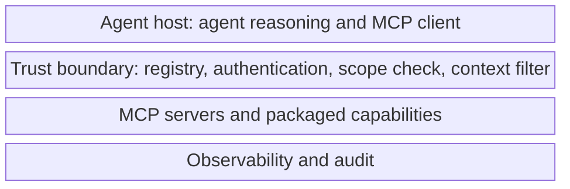

# Secure MCP and Capability Governance

## Context

The Model Context Protocol (MCP), along with skills, plugins, and packaged extensions, lets an agent host discover and call external capabilities. A capability that is added to the agent's catalogue becomes an authority-bearing boundary: it can read, write, send, modify, deploy, or approve in real systems on behalf of the agent.

This pattern applies wherever an agent host:

- Discovers, installs, or connects to MCP servers, skills, plugins, or extensions.
- Loads capability descriptions, tool definitions, and parameter schemas from those servers.
- Forwards prompts, retrieved context, memory, or tool output across the host-to-server boundary.
- Receives responses that are passed back into the agent's reasoning context or used to drive further tool calls.

The pattern sits between the secure agent runtime and the secure tool calling pattern. The runtime decides that a capability should be invoked; this pattern decides whether that capability is trustworthy enough to be in scope at all, and what crosses the boundary in each direction.

## Risk

MCP servers and packaged capabilities concentrate several failure modes from [docs/01-threat-model.md](../docs/01-threat-model.md):

- **Capability sprawl.** Servers are added quickly during prototyping and rarely removed. The effective authority of the agent grows beyond what any single review approved.
- **Misrepresented capability.** A server's description claims one operation but the implementation does more — for example, a "summarise" tool that also writes to an external store.
- **Post-install drift.** A server can change after installation. New tools, expanded scopes, or modified schemas can appear without re-review.
- **Context leakage.** The host forwards prompts, retrieved content, or memory across the host-to-server boundary. Sensitive data can leave the agent's trust boundary unintentionally.
- **Untrusted instruction injection via responses.** A server can return content that contains instructions the agent treats as control input. This is prompt injection delivered through the capability layer.
- **Authentication and identity confusion.** Agents may connect to servers without strong server identity verification, or may use a single shared identity for multiple tasks, breaking task-bound authority.
- **Supply chain weakness.** A capability is only as trustworthy as its source, build process, dependencies, and update channel. A compromise upstream becomes capability-level authority downstream.

## Recommended Controls

The host-side controls below define a trust and policy boundary between the agent host and any MCP server, skill, plugin, or extension.

1. **Capability registry with version pinning.** Every capability that the agent can use is listed in a registry with source, version, schema, capability category, sensitivity scope, owner, and review status. Tasks resolve to specific versions at intake.
2. **Server authentication.** Verify server identity before sending any request. Use strong identity (mutual TLS, signed manifests, attested origin) where supported.
3. **Capability scope check.** Each call is checked against the registered capability scope, the task scope, and the user's authority. Out-of-scope calls are denied.
4. **Context isolation filter.** Outbound requests pass through a filter that strips or summarises content the server does not need to see, based on data sensitivity labels.
5. **Response validation.** Server responses are schema-validated, source-labelled, and treated as untrusted data before they re-enter the agent's reasoning step. Instruction-shaped content in responses must not redefine goals, allowlists, or memory write policy.
6. **Review on add and on change.** Adding a capability is a reviewable event. Changes to manifest, scope, schemas, or version trigger re-review and, by default, suspend use until reviewed.
7. **Default deny for unregistered capabilities.** The host refuses to talk to servers, skills, or extensions that are not in the registry, even if they are reachable.
8. **Revocation and emergency disable.** Every capability has a documented revocation path and an emergency disable that can take effect across all running tasks.
9. **Per-capability identity.** Each capability uses a credential issued by the broker for the task and call, not a long-lived shared identity. See [credential-and-token-boundaries.md](credential-and-token-boundaries.md).
10. **Supply chain review.** Capability source, build, dependencies, and update channel are part of the review record. Significant supply chain changes trigger re-review.

## Boundary Diagram

The diagram shows the host process, the trust and policy boundary, and the MCP servers or packaged capabilities. It makes the four key host-side checks explicit: registry and version pinning, server authentication, capability scope check, and context isolation filter — plus response validation on the return path.

Source: [secure-mcp-boundaries.mmd](../visuals/secure-mcp-boundaries.mmd). A block diagram is used because the point is the trust boundary between three layers (host, boundary, servers), not the temporal flow. The picture clarifies that capabilities are not transparent extensions of the host: there is a layer of checks between them.

## Implementation Notes

- **Treat the registry as authoritative.** If a capability is reachable but not registered, the host should refuse to use it. Discovery does not imply trust.
- **Pin versions per task.** Resolve the capability version at task intake and bind it for the duration of the task. Mid-task updates should not silently change behaviour.
- **Sign capability manifests.** Where the ecosystem supports it, require signed manifests and verify signatures against a known publisher list.
- **Tag forwarded context.** Outbound requests should carry source labels so server-side processing knows what it is receiving. The host should redact or refuse to forward content above the capability's sensitivity scope.
- **Quarantine instruction-shaped responses.** Patterns like imperatives, role redefinitions, or system-style directives in tool output should be flagged for instruction-data separation. The agent should see them as quoted evidence, not as control.
- **Catalogue the data each capability sees.** A capability that needs a query but is sent the full prompt history is over-scoped. The context isolation filter should narrow input to what the capability actually requires.
- **Rotate and revoke.** Maintain a process to rotate capability credentials, revoke compromised ones, and disable a capability across all tasks within minutes of a decision.
- **Treat skills and plugins like MCP servers.** The same registry, scope check, and review process should apply across all packaged capabilities, regardless of vendor or transport.
- **Test capability behaviour, not only its description.** Black-box tests should exercise edge cases that the manifest does not document, especially side effects and outbound network calls.

## Failure Modes Covered

Direct coverage from the [threat model](../docs/01-threat-model.md):

- **MCP, skill, and extension compromise** — primary coverage; this pattern exists for it.
- **Tool misuse via packaged capabilities** — registry, scope check, and per-call review prevent unregistered or out-of-scope capability use.
- **Context poisoning via capability responses** — response validation, source labelling, and instruction-data separation reduce the chance that responses act as instruction.
- **Credential and token misuse at the capability boundary** — per-capability identity and broker-issued credentials prevent shared, long-lived authority.

Partial coverage:

- **Prompt and instruction attacks** — covered when delivered through capability responses; instruction attacks delivered through retrieval are addressed by the runtime pattern.
- **Multi-agent propagation** — covered for agent-to-server hand-offs; agent-to-agent propagation remains a planned pattern.

## Evaluation Checks

- Is every capability the agent can reach listed in the registry with source, version, schema, capability category, sensitivity scope, owner, and review status?
- Does the host refuse, by default, to talk to a reachable but unregistered server in a synthetic test?
- When a capability manifest changes between tasks, does the host detect the change and require re-review before further use?
- For each capability, does the context isolation filter restrict outbound content to what the capability needs?
- When a server response contains instruction-shaped content, does the agent receive it as quoted evidence rather than as control?
- Can a capability be revoked across all running tasks within the documented emergency-disable target?
- For ten randomly selected capability calls, can a reviewer recover server identity verification, capability version, scope check, outbound content sent, response, and validation result?

## Audit Evidence

For each capability invocation, a reviewer should be able to retrieve under the task's trace identifier:

- Capability name, source, registry entry, version pinned, and signature verification result.
- Server authentication result and method.
- Capability scope check decision with matched rule and reason.
- Outbound content after the context isolation filter, including any redactions or refusals.
- The credential identity and scope issued for the call.
- Raw and validated server response, source label applied, and any quarantine decisions.
- Outcome-control decision and downstream effect where applicable.
- Add, change, and revocation events for the capability across the audit window.

Audit records should be queryable by capability, by version, by task, by identity, and by review status.

## Limitations

- A registry is only as strong as its review process. Rapid prototyping environments often lack the reviewers; in those environments the registry should still default deny, but teams should accept that the bottleneck is review, not technology.
- Capability behaviour can change after review even when the manifest does not. Black-box testing reduces but does not eliminate this risk.
- Strong server authentication assumes the ecosystem supports it. Where it does not, teams should treat the capability as lower trust and tighten scope, output validation, and approval gates.
- Context isolation filters can leak through paraphrase or summarisation. Sensitive content should not be assumed safe just because it has been transformed.
- Supply chain risk extends beyond the host's control. Even thorough review cannot guarantee no compromise upstream. Revocation speed and audit reach are the compensating controls.
- Per-capability identity adds operational complexity. Teams should expect work in credential rotation, identity provisioning, and incident response procedures.

## Related

- [docs/01-threat-model.md](../docs/01-threat-model.md) — failure mode 7 (MCP, skill, and extension compromise).
- [docs/02-attack-surfaces.md](../docs/02-attack-surfaces.md) — MCP, skills, and extensions surface; code, MCP, skills, and extensions section.
- [docs/03-agentic-attack-chains.md](../docs/03-agentic-attack-chains.md) — Chain Pattern 1 and Chain Pattern 4.
- [docs/04-defence-architecture.md](../docs/04-defence-architecture.md) — Tool broker and identity and access layers.
- Sibling patterns: [secure-agent-runtime.md](secure-agent-runtime.md), [secure-tool-calling.md](secure-tool-calling.md), [credential-and-token-boundaries.md](credential-and-token-boundaries.md).

Maturity: stable defensive guidance. Last reviewed: 2026-04-29.
