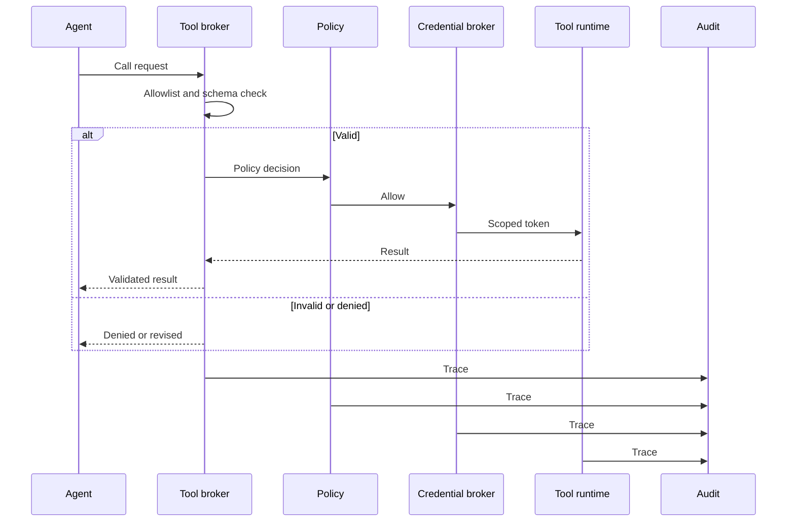

# Secure Tool Calling

## Context

Tool calling is the moment when language-shaped intent crosses into system action. The agent proposes an operation against an API, function, plugin, MCP server, skill, file, command, or workflow. Whatever the tool reads, writes, sends, deploys, purchases, or approves becomes part of the system's behaviour from that point on.

This pattern applies wherever an agent can:

- Choose between multiple tools for a single goal.
- Construct tool parameters from a mix of user goal, retrieved content, memory, and prior tool results.
- Chain tool calls so that the result of one shapes the next.
- Reach a tool that affects a real system, customer, or financial state — directly or via a workflow.

The pattern works alongside the secure agent runtime: the runtime decides that a tool call should be attempted, and this pattern decides whether and how it should actually execute.

## Risk

Tool calls compose several failure modes from [docs/01-threat-model.md](../docs/01-threat-model.md):

- **Wrong tool, right intent.** The agent picks a tool that can complete the task but exceeds the user's authority, sensitivity scope, or expected blast radius.
- **Right tool, manipulated parameters.** Parameters are constructed from untrusted retrieved content or memory and silently expand scope (file paths, recipients, recipients lists, account identifiers, queries).
- **Unsafe composition.** Each individual call is acceptable; the chain is not. A read followed by a summarisation followed by a send can become an exfiltration path.
- **Unbounded outputs.** Tool results carry untrusted content back into the reasoning step. If the runtime treats them as instruction, the agent's next step is shaped by the tool, not by the user.
- **Schema drift.** Tools change over time. A runtime that validates against an outdated schema can pass parameters the tool will misinterpret, or block parameters that are now legitimate.
- **Identity confusion.** Without a credential broker, a tool call may run under a long-lived identity that is not bound to the user, the task, or the approval — making accountability unclear and blast radius unknown.

## Recommended Controls

Tool calling should be mediated, validated, and bounded — never direct from the agent to the tool runtime.

1. **Tool broker.** All tool calls pass through a broker that knows the task scope, identity, allowlist, schemas, policy, and credential boundary. The agent should never have a direct connection to a tool endpoint.
2. **Per-task allowlist.** The runtime pins which tools are usable for the current task at intake. The broker rejects calls to tools outside the list.
3. **Strict schema validation on inputs and outputs.** Parameters are validated against the live schema before execution. Outputs are validated and, where appropriate, redacted, summarised, or quarantined before they re-enter the reasoning step.
4. **Risk-aware policy decision.** A read-only lookup, a summarisation, and a send are not the same risk class. Policy should evaluate intent, identity, parameters, sensitivity, and downstream system together.
5. **Composition checks.** The broker should detect risky chains (read sensitive → external send, modify config → deploy, retrieve credentials → call external) and require approval or deny when chains cross policy lines.
6. **Approval for sensitive tools and chains.** Sensitive, irreversible, or out-of-scope calls require an approval prompt that shows source context, parameters, identity, expected effect, and rollback path.
7. **Scoped credentials issued by a broker.** Credentials are issued per task, per call, with the narrowest scope and shortest lifetime that completes the operation. See [credential-and-token-boundaries.md](credential-and-token-boundaries.md).
8. **Output handling.** Tool output is treated as untrusted data, not instruction. Source labels accompany output as it re-enters the reasoning context.
9. **Outcome control.** Dry runs, previews, post-action validation, rate limits, blast-radius limits, and rollback should sit between the tool runtime and downstream impact.
10. **Rate limits and circuit breakers.** Per-task and per-identity limits on call count, data movement, and downstream cost. Anomalous bursts trigger pause-and-review.

## Boundary Diagram

The flow diagram traces a tool call from agent request through broker, allowlist, schema validation, policy decision, optional approval, credential broker, tool runtime, output validation, and outcome control. Every stage has a deny or revise branch and an audit edge.

Source: [secure-tool-calling-flow.mmd](../visuals/secure-tool-calling-flow.mmd). The diagram is the canonical picture of "the agent never reaches the tool runtime directly".

## Implementation Notes

- **Define each tool with a security manifest, not only a function signature.** Capability category (read, write, send, modify, delete, deploy, approve, purchase), data sensitivity scope, target systems, identity binding, parameter schema, expected output schema, side-effect class, and revocation contact.
- **Pin schemas per task.** A task should resolve to a specific tool version and schema at intake. Schema drift should be caught at the broker, not at the tool.
- **Validate parameters in two passes.** Pass one is structural (does it match the schema?). Pass two is semantic (do values fall inside the task scope, identity, and policy bounds?). Structural validation alone allows scope expansion through legal-but-unintended values.
- **Treat tool output as data, not instruction.** Output should be quoted, source-labelled, and passed back to the agent as evidence. The runtime should not allow tool output to redefine the goal, allowlist, or memory write policy.
- **Detect risky chains, not only risky calls.** Maintain a small library of unsafe composition patterns (see Composition Review in [docs/02-attack-surfaces.md](../docs/02-attack-surfaces.md)) and check them against the running plan, not only the next single call.
- **Default deny for unknown parameters.** If a parameter is not present in the schema or the task scope, refuse rather than guess.
- **Make the broker decision visible to the agent.** When the broker denies or revises a call, the reason should be returned so the agent can plan an alternative — not silently retry.
- **Per-tool circuit breakers.** A tool that errors or returns malformed output past a threshold should be paused for the task and logged for review.
- **Per-tool dry-run mode.** Where the target system supports it, prefer dry runs for sensitive calls and require explicit promotion to a real call.

## Failure Modes Covered

Direct coverage from the [threat model](../docs/01-threat-model.md):

- **Tool misuse and unsafe composition** — primary coverage; this pattern exists for it.
- **Prompt and instruction attacks reaching action** — output handling and instruction-data separation prevent tool output from becoming control.
- **Goal hijacking that surfaces as a risky tool call** — composition checks and per-task allowlist catch drift that has reached the tool layer.
- **MCP, skill, and extension compromise at call time** — the broker enforces capability scope; pre-call review lives in [secure-mcp.md](secure-mcp.md).
- **Unsafe autonomous action** — approval gates, outcome control, and rate limits keep autonomy bounded.

Partial coverage:

- **Credential and token misuse** — broker enforces that calls receive scoped credentials; issuance lives in [credential-and-token-boundaries.md](credential-and-token-boundaries.md).
- **Context poisoning** — output handling prevents tool results from acting as instruction, but retrieval-side controls live in the (planned) context-poisoning pattern.

## Evaluation Checks

- For each tool in the catalogue, is there a security manifest with capability category, sensitivity scope, target system, parameter schema, output schema, and side-effect class?
- For ten randomly selected tool calls, can a reviewer recover the trace identifier, broker decision, schema version, parameters, policy decision, identity used, output, and outcome-control decision?
- When an injected untrusted instruction asks the agent to call an out-of-allowlist tool, does the broker deny at the allowlist stage and log the attempt?
- When a parameter falls outside the task scope (a different account, a sensitive path), does semantic validation catch it before the tool runs?
- For each defined unsafe composition pattern, does the broker block or escalate when the plan matches?
- Does tool output enter the agent reasoning step with a source label that prevents it being treated as instruction?
- Do per-task and per-identity rate limits trigger pause-and-review on synthetic burst tests?

## Audit Evidence

For each tool call, a reviewer should be able to retrieve under the task's trace identifier:

- The proposed call (tool, parameters, intent), the broker's decision (allow, deny, revise, require approval), and the matched policy.
- The schema version validated against and any validation result (pass, transformed, blocked).
- The credential identity and scope issued for the call (without exposing the secret value).
- The tool runtime, raw and post-validated output, and any quarantine or redaction decisions.
- The outcome-control decision (dry run, preview, executed, blocked, rolled back) with the validating evidence.
- The downstream system change, business owner where applicable, and rollback path.
- The composition-check result if the call was part of a risky chain.

Audit records should be queryable by tool, by task, by identity, by downstream system, and by composition pattern.

## Limitations

- The broker cannot enforce policy on tools that are not registered with it. Discovery, registration, and revocation of tools is a prerequisite — see [secure-mcp.md](secure-mcp.md).
- Composition detection is heuristic. New unsafe chains will be discovered after deployment; the catalogue should be treated as living.
- Strict schemas can block legitimate variation. Teams should track false denies and tune schemas through review, not by removing validation.
- Output validation can be bypassed if downstream code reads the raw tool output instead of the post-validated stream. The runtime should not expose the raw stream.
- Rate limits and circuit breakers shape behaviour but do not stop a single high-impact call. Approval gates and outcome control remain necessary for irreversible actions.
- Outcome control depends on the target system supporting previews, dry runs, or rollback. Some systems do not — for those, approval gates should be stricter.

## Related

- [docs/02-attack-surfaces.md](../docs/02-attack-surfaces.md) — Tool and Workflow Surfaces, Composition Review.
- [docs/03-agentic-attack-chains.md](../docs/03-agentic-attack-chains.md) — Chain Pattern 1 (instruction influence to tool action) and Chain Pattern 4 (broad authority to downstream change).
- [docs/04-defence-architecture.md](../docs/04-defence-architecture.md) — Tool broker, policy decision, and outcome control layers.
- Sibling patterns: [secure-agent-runtime.md](secure-agent-runtime.md), [secure-mcp.md](secure-mcp.md), [credential-and-token-boundaries.md](credential-and-token-boundaries.md), [memory-security.md](memory-security.md).

Maturity: stable defensive guidance. Last reviewed: 2026-04-29.
